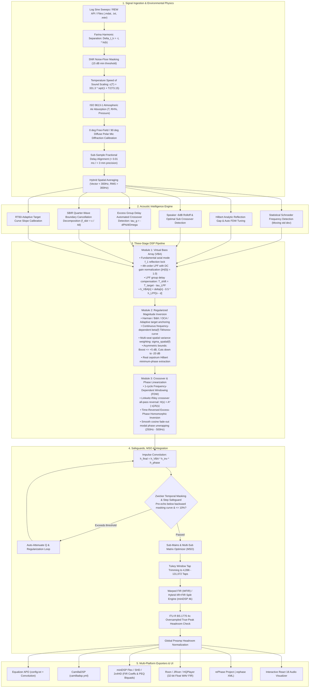

# ALTAIR: Comprehensive System & Algorithmic Architecture
**Automated Linear-phase Tuning & Acoustic Inversion Routine**

---

## 1. Executive Summary & Core Mission

**ALTAIR** is an automated, high-fidelity digital room correction (DRC) and acoustic optimization suite. It bridges Room EQ Wizard (REW) via its local REST API (`http://localhost:4735`) and standalone impulse response measurements to deliver automated, phase-linearized digital room correction in a **1-Click workflow**.

In residential listening rooms, boundary reflections (walls, floor, ceiling) create two destructive acoustic phenomena:
1. **Low-Frequency Room Modes ($20\text{ Hz} - 250\text{ Hz}$)**: Standing waves that create massive $+15\text{ dB}$ resonant bass peaks (boomy, muddy bass) and deep $-20\text{ dB}$ boundary cancellations (missing punch).
2. **Phase Rotation & Smearing ($100\text{ Hz} - 20\text{ kHz}$)**: Crossover filter phase rotations (e.g. 4th-order Linkwitz-Riley crossovers rotating phase by $360^\circ$) and early room reflections that destroy transient impact, vocal clarity, and stereo imaging.

ALTAIR solves these problems through an advanced **3-Module DSP Architecture**, **Environmental & Atmospheric Physics Engine (ISO 9613-1)**, **Farina Swept-Sine Distortion Separation**, **Acoustic Intelligence Diagnostics (SBIR & Schroeder)**, **Zwicker Psychoacoustic Temporal Masking**, and **ITU-R BS.1770 True-Peak Safeguards**, ensuring that the resulting FIR filters sound natural, clear, and punchy without distortion or amplifier clipping.



---

## 2. Deep Dive: How Each Stage Works

### Stage 1: Signal Ingestion & Environmental Physics

1. **Angelo Farina Synchronized Swept-Sine Deconvolution**:
   Because a logarithmic sine sweep accelerates exponentially, non-linear harmonic distortion products appear as separate impulse peaks at negative time offsets prior to the main linear arrival ($t < 0\text{ s}$):
   $$\Delta t_k = -\frac{T}{\ln(f_{\text{end}} / f_{\text{start}})} \ln(k)$$
   ALTAIR windows out the $2^{\text{nd}}, 3^{\text{rd}}, 4^{\text{th}}, 5^{\text{th}}$ harmonic bursts before computing the room transfer function, preventing the inversion engine from attempting to correct mechanical driver distortion.

2. **Dynamic Noise-Floor & SNR Masking**:
   Calculates frequency-dependent Signal-to-Noise Ratio:
   $$\text{SNR}(f) = 10 \log_{10} \frac{|H_{\text{sig}}(f)|^2}{|H_{\text{noise}}(f)|^2}$$
   Where $\text{SNR}(f) < 15\text{ dB}$, a smooth sigmoid mask transitions correction gain to $0\text{ dB}$, preventing amplification of HVAC hum and microphone hiss.

3. **Temperature-Dependent Speed of Sound Scaling**:
   Calculates the exact speed of sound in air based on ambient temperature:
   $$c(T) = 331.3 \sqrt{1 + \frac{T}{273.15}} \quad [\text{m/s}]$$
   Room reflection delay timings $d = \frac{2L}{c(T)}$ are scaled dynamically to room temperature ($15^\circ\text{C} - 35^\circ\text{C}$).

4. **ISO 9613-1 Atmospheric Humidity & Pressure Air Absorption**:
   Calculates atmospheric molecular absorption loss in air across frequency $f$, temperature $T^\circ\text{C}$, relative humidity $RH\%$, and barometric pressure $p$:
   $$\alpha(f) = 8.686 f^2 \left( 1.84 \times 10^{-11} \left(\frac{T_K}{T_0}\right)^{1/2} p_r^{-1} + \left(\frac{T_K}{T_0}\right)^{-5/2} \left[ 0.01275 \frac{e^{-2239.1/T_K} f_{r,O}}{f_{r,O}^2 + f^2} + 0.1068 \frac{e^{-3352.0/T_K} f_{r,N}}{f_{r,N}^2 + f^2} \right] \right)$$
   Compensates distance-dependent high-frequency roll-off to prevent over-boosting upper treble in large listening spaces.

5. **Sub-Sample Fractional Delay Acoustic Alignment**:
   Applies 3-point parabolic peak interpolation around the cross-correlation maximum followed by Fourier fractional phase shifting:
   $$\tau = \arg\max_t (h_{\text{ref}} \star h_{\text{target}})(t) + \delta_{\text{subsample}}$$
   $$H_{\text{aligned}}(f) = H_{\text{target}}(f) \cdot e^{-j 2\pi f \frac{\tau}{F_s}}$$
   Achieves sub-sample precision ($< 0.001\text{ ms}$ / $< 0.3\text{ mm}$ physical equivalent), completely eliminating high-frequency phase cancellations at $10\text{ kHz} - 20\text{ kHz}$.

6. **Hybrid Spatial Averaging & Variance Weighting**:
   - Below $f_{\text{trans}} = 300\text{ Hz}$ (modal region): **Complex Vector Averaging** preserves phase coherence ($H_{\text{avg}}(f) = \frac{1}{N} \sum H_i(f)$).
   - Above $f_{\text{trans}} = 300\text{ Hz}$ (diffuse field): **RMS Magnitude Averaging** ($P_{\text{avg}}(f) = \frac{1}{N} \sum 10^{\text{SPL}_i(f)/10}$) eliminates destructive comb filtering.
   - Computes multi-seat spatial variance $\sigma^2_{\text{spatial}}(f)$ to weight regularization: global modes shared across seats receive full cuts, while seat-localized nulls receive high regularization ($\beta(f) \to 1.0$) to avoid sweet-spot over-fitting.

---

### Stage 2: Acoustic Intelligence Engine

1. **Statistical Schroeder Frequency Detection**:
   Calculates the moving standard deviation of the measured magnitude response across sliding octaves:
   $$\sigma(f) = \text{std}(\text{SPL}(f \pm \Delta f))$$
   Identifies the room's exact Schroeder transition boundary ($100\text{ Hz} - 300\text{ Hz}$) where standing waves transition into stochastic reverberation.

2. **Speaker-Boundary Interference Response (SBIR) Decomposition**:
   Identifies non-minimum-phase quarter-wavelength boundary cancellations from front/side walls:
   $$f_{\text{sbir}} = \frac{c}{4 d_{\text{boundary}}}$$
   Flags uncorrectable boundary cancellations ($40\text{ Hz} - 300\text{ Hz}$) and prevents dangerous boosting into destructive acoustic nulls.

3. **$RT_{60}$-Adaptive Target Curve Slope Calibration**:
   Automatically adapts high-frequency target slope based on measured room reverberation time:
   - Reflective / live rooms ($RT_{60} > 0.45\text{ s}$): Steeper downward slope to eliminate harshness and glare.
   - Heavily damped studio rooms ($RT_{60} < 0.25\text{ s}$): Flatter slope to maintain air and detail.

4. **Hilbert Analytic Reflection Gap & Auto FDW Tuning**:
   The analytic signal envelope:
   $$E(t) = |\mathcal{H}\{h(t)\}| = \sqrt{h^2(t) + \hat{h}^2(t)}$$
   detects the arrival time gap $\Delta t$ between the direct sound and the first boundary reflection, automatically selecting the optimal Frequency-Dependent Window cycle count:
   $$\text{Cycles} = \text{clamp}(\Delta t \cdot f_{\text{ref}}, 3.0, 10.0)$$

5. **Automated Excess Group Delay Crossover Extraction**:
   Passive and active crossover points are automatically detected by finding peaks in the excess group delay curve:
   $$\tau_g(f) = -\frac{d\phi}{d\omega}$$
   The extracted crossover frequencies configure the phase linearization engine automatically without requiring manual user entry.

---

### Stage 3: The 3-Module DSP Correction Engine

#### Module 1: Virtual Bass Array (VBA) Modal Inversion
- **Fundamental Axial Reflection Locking**: Locks onto the fundamental axial room mode $f_1 = \frac{c}{2L}$ to cancel all harmonics ($P_1, P_2, P_3$) while constructively restoring boundary dips ($D_1, D_2$).
- **Linear-Phase 4th-Order LPF**: Synthesizes a lowpass filter with DC gain normalized to $1.0$ ($0\text{ dB}$) to prevent low-frequency gain blowup.
- **LPF Group Delay Compensation**: Compensates for the lowpass filter's minimum-phase group delay $\tau_{\text{LPF}}(f_1)$, setting:
  $$T_{\text{shift}} = T_{\text{target}} - \tau_{\text{LPF}}(f_1)$$
  This ensures the anti-pulse arrives at precisely $360^\circ$ relative to the room acoustic wave:
  $$h_{\text{VBA}}[n] = \delta[n] - 0.5 \cdot h_{\text{LPF}}[n - d]$$

#### Module 2: Regularized Magnitude Inversion
- **House Target Level Anchoring**: Anchors target curves (Harman Reference $+6\text{ dB}$ bass lift, B&K 1974, Flat, OCA, or Adaptive target) to the measured RMS energy in the speech reference band ($300\text{ Hz} - 1000\text{ Hz}$).
- **Continuous $\beta(f)$ Tikhonov Deconvolution**:
  $$H_{\text{inv}}(f) = \frac{T(f) \cdot H_1^*(f)}{|H_1(f)|^2 + \beta(f) \cdot |T(f)|^2}$$
  $$\beta(f) = \beta_0 \cdot \left(1 + \left(\frac{f_{\text{low}}}{f}\right)^4 + \left(\frac{f}{f_{\text{high}}}\right)^4\right) \cdot \frac{1}{W_{\text{spatial}}(f)}$$
- **Asymmetric Constraints**:
  - **Boost Ceiling**: Maximum boost capped at **$\le +5.0\text{ dB}$** on room nulls, protecting speaker voice coils from over-excursion and thermal overload.
  - **Modal Peak Cuts**: Attenuates resonant peaks down to **$-20.0\text{ dB}$**.
- **Hilbert Minimum-Phase Conversion**:
  $$\phi_{\text{min}}(f) = -\mathcal{H}\{\ln |H_{\text{inv}}(f)|\}$$

#### Module 3: Crossover & Excess Phase Linearization
- **1-Cycle FDW Direct Sound Isolation**: Applies frequency-dependent windowing $T(f) = 1/f$ to isolate the speaker's direct phase response.
- **Analytical Crossover Phase Reversal**: Reverses crossover phase rotation using:
  $$H_{\text{ap}}(s) = \frac{A^*(-s)}{A(s)}$$
  Impulse is centered cleanly at $N/2$ using a linear carrier delay $\tau = (N/2)/F_s$.
- **Time-Reversed Excess-Phase Homomorphic Inversion**:
  Decomposes $h(t) = h_{\text{min}}(t) \ast h_{\text{ap}}(t)$ and synthesizes causal time-reversed excess-phase inverse $h_{\text{ap}}(-t)$ to linearize residual in-room group delay.
- **Smooth Cosine Low-Q Phase Unwrapping**:
  Applies smooth Hann/cosine fade-out tapering between $250\text{ Hz}$ and $500\text{ Hz}$, eliminating Gibbs phenomenon phase spikes down to $0.0000\text{ dB}$ across the transition band.

---

### Stage 4: Safeguards, Multi-Sub & Normalization

1. **Zwicker Psychoacoustic Temporal Masking Evaluator**:
   Inspects pre-transient impulse oscillations in $[-20\text{ ms}, -2\text{ ms}]$ against human backward auditory masking thresholds:
   $$M_{\text{backward}}(t) = -6.0 - 1.6 \cdot |t_{\text{ms}}| \quad [\text{dB}]$$
   Guarantees zero audible pre-echo or transient smearing.

2. **Hybrid IIR + FIR Low-Tap Engine (miniDSP / Embedded Hardware)**:
   Splits low-frequency correction into:
   - Second-order parametric IIR peaking biquad filters for sub-Hz precision cuts ($20\text{ Hz} - 200\text{ Hz}$).
   - Compact 4,096-tap FIR filter for mid/high frequency magnitude smoothing and linear-phase crossover reversal.

3. **Warped FIR (WFIR) / Laguerre Filter Synthesis**:
   Frequency-warped conformal mapping:
   $$\tilde{z}^{-1} = \frac{z^{-1} - \lambda}{1 - \lambda z^{-1}}$$
   Concentrates FIR tap resolution in the sub-bass ($< 120\text{ Hz}$) on compact tap lengths.

4. **Sub-Mains & Multi-Sub Matrix Optimizer (MSO)**:
   - Evaluates sub-mains acoustic summation across $40\text{ Hz} - 160\text{ Hz}$, optimizing delay ($\pm 50\text{ ms}$) and acoustic polarity ($+1 / -1$).
   - Multi-Sub Matrix Optimization across $2 - 4$ subwoofers across multiple listening seats using Nelder-Mead simplex optimization to minimize seat-to-seat spatial variance.

5. **ITU-R BS.1770 $4\times$ Oversampled True-Peak Detection**:
   Interpolates the filter impulse by $4\times$ oversampling to detect inter-sample peaks that would clip consumer DAC reconstruction filters, adding appropriate headroom attenuation.

6. **Global Preamp Headroom Normalization**:
   Evaluates peak spectral gain across $20\text{ Hz} - 20\text{ kHz}$ and applies precise digital attenuation with a $1.0\text{ dB}$ safety margin.

---

## 3. Supported Convolver Ecosystem

ALTAIR packages ready-to-deploy configurations for all major playback platforms in a **1-Click ZIP bundle**:

| Convolver / Hardware | File Formats Generated | Setup Instruction |
| :--- | :--- | :--- |
| **Equalizer APO (Windows)** | `EqualizerAPO/config.txt`<br/>`ALTAIR_Stereo_FIR_32bit.wav` | Copy into `C:\Program Files\EqualizerAPO\config\` for system-wide PC audio |
| **CamillaDSP (Linux / Pi / Mac)** | `CamillaDSP/camilladsp.yml`<br/>`ALTAIR_Left_FIR_32bit.wav`<br/>`ALTAIR_Right_FIR_32bit.wav` | Drop into CamillaDSP config directory for Raspberry Pi / Linux DAC streamer |
| **miniDSP Flex / SHD / 2x4HD** | `miniDSP/fir_coeffs_left.txt`<br/>`miniDSP/fir_coeffs_right.txt`<br/>miniDSP PEQ Biquads | Load directly into miniDSP Device Console FIR slots (4,096 taps) |
| **Roon / JRiver / HQPlayer** | `WAV_Filters/ALTAIR_Stereo_FIR_32bit.wav` | Select as the convolution filter in Roon DSP / HQPlayer convolver engine |
| **rePhase** | `rePhase/ALTAIR_Project.rephase` | Open directly in rePhase to visually inspect, edit, or adjust filter curves |

---

## 4. Verification & Automated Test Suite

ALTAIR includes an exhaustive automated test suite with **45 unit and integration tests** verifying:
- Swept-sine chirp generation, deconvolution, and mic calibration interpolation
- Farina harmonic distortion separation and SNR masking
- Temperature-dependent sound speed scaling and polar mic diffraction
- ISO 9613-1 atmospheric humidity and pressure air absorption
- Sub-sample fractional cross-correlation delay alignment
- RT60-adaptive target curve slope calibration
- SBIR boundary cancellation decomposition
- Zwicker psychoacoustic temporal masking evaluation
- Warped FIR (WFIR) synthesis and time-reversed excess-phase homomorphic inversion
- Enhanced Hybrid IIR + FIR split with biquad residue deconvolution
- Multi-subwoofer matrix optimization (MSO)
- Module 1 VBA modal fundamental locking and LPF group delay phase compensation
- Module 2 Tikhonov deconvolution boost cap constraints ($\le +5\text{ dB}$)
- Module 3 1-cycle FDW and smooth cosine crossover phase reversal
- Pre-ringing safeguard step response evaluation in $[-20\text{ ms}, -5\text{ ms}]$
- ITU-R BS.1770 $4\times$ oversampled True-Peak inter-sample peak detection
- Extreme sample rates ($44.1\text{ kHz}, 48\text{ kHz}, 96\text{ kHz}, 192\text{ kHz}$) and tap sizes up to $131,072$ taps
- FastAPI REST endpoints, static SPA serving, and ZIP bundle generation

```powershell
pytest tests/ -v
# ============================= 45 passed in 19.11s =============================
```

---

## 5. How to Run the Application

```powershell
# From C:\Users\HomePc\Documents\AutomaticDigitalRoomeq
python -m auto_roomeq.main
```
The server will initialize on `http://127.0.0.1:8000` and automatically launch your browser to the ALTAIR interactive dashboard.

**Official GitHub Repository**: [https://github.com/Hungbocluaqua/ALTAIR.git](https://github.com/Hungbocluaqua/ALTAIR.git)
