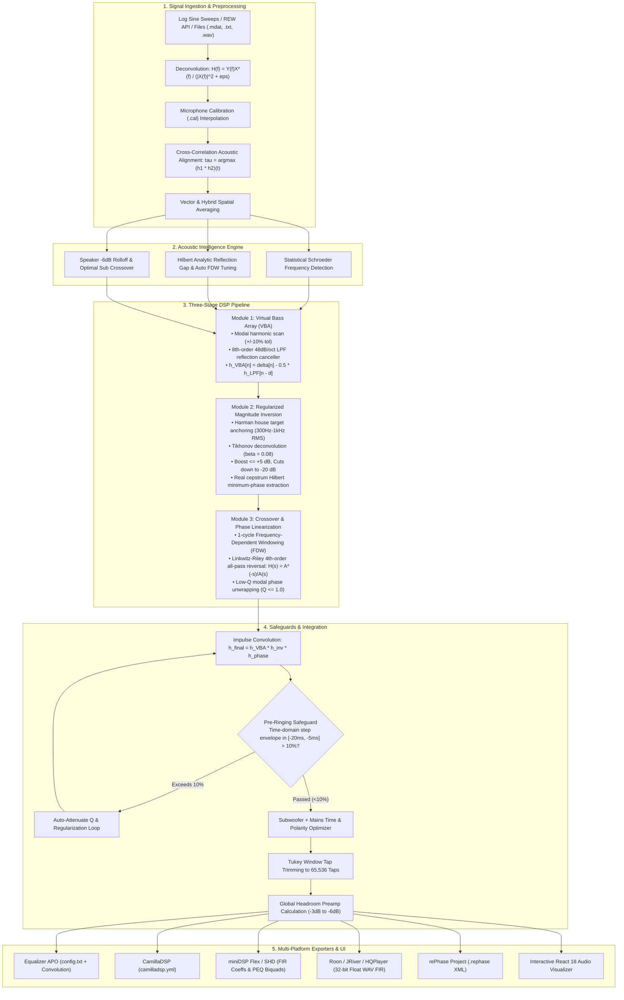

# ALTAIR: Comprehensive System & Algorithmic Analysis
**Automated Linear-phase Tuning & Acoustic Inversion Routine**

---

## 1. Executive Summary & Core Mission

**ALTAIR** is an automated, high-fidelity digital room correction (DRC) and acoustic optimization suite. It bridges Room EQ Wizard (REW) via its local REST API (`http://localhost:4735`) and standalone impulse response measurements to deliver automated, phase-linearized digital room correction in a **1-Click workflow**.

In modern residential listening rooms, boundary reflections (walls, floor, ceiling) create two destructive acoustic phenomena:
1. **Low-Frequency Room Modes ($20\text{ Hz} - 250\text{ Hz}$)**: Standing waves that create massive $+15\text{ dB}$ resonant bass peaks (boomy, muddy bass) and deep $-20\text{ dB}$ boundary cancellations (missing punch).
2. **Phase Rotation & Smearing ($100\text{ Hz} - 20\text{ kHz}$)**: Crossover filter phase rotations (e.g. 4th-order Linkwitz-Riley crossovers rotating phase by $360^\circ$) and early room reflections that destroy transient impact, vocal clarity, and stereo imaging.

ALTAIR solves these problems through a **3-Module DSP Architecture**, **Acoustic Intelligence**, and **Pre-Ringing Safeguards**, ensuring that the resulting FIR filters sound natural, clear, and punchy without distortion.



---

## 2. Deep Dive: How Each Stage Works

### Stage 1: Signal Ingestion & Acoustic Alignment

1. **Synchronized Logarithmic Sweep Generation**:
   ALTAIR generates a pure mathematical logarithmic sine chirp spanning $10\text{ Hz} \to 24\text{ kHz}$ over $N = 2^{20} = 1,048,576$ samples ($21.845\text{ s}$ at $48\text{ kHz}$). The instantaneous phase is governed by:
   $$\phi(t) = \frac{2\pi f_{\text{start}} T}{\ln(f_{\text{end}} / f_{\text{start}})} \left( \left(\frac{f_{\text{end}}}{f_{\text{start}}}\right)^{t/T} - 1 \right)$$
   A $10\text{ ms}$ high-frequency ($8\text{ kHz}$) acoustic timing marker burst is prepended to provide a millisecond-accurate acoustic timing reference.

2. **Regularized Spectral Deconvolution**:
   When excitation $x[n]$ is played and recorded as $y[n]$, ALTAIR computes the linear Room Impulse Response (RIR) $h[n]$ via regularized division:
   $$H(f) = \frac{Y(f) \cdot X^*(f)}{|X(f)|^2 + \epsilon \cdot \max(|X|^2)}$$

3. **Cross-Correlation Acoustic Alignment**:
   Left and Right channels are aligned to zero relative acoustic arrival delay using the cross-correlation maximum:
   $$\tau = \arg\max_t (h_{\text{ref}} \star h_{\text{target}})(t) = \arg\max_t \mathcal{F}^{-1}\left\{ H_{\text{ref}}(f) \cdot H_{\text{target}}^*(f) \right\}$$

4. **Hybrid Spatial Averaging**:
   To prevent destructive comb filtering when combining multiple measurement seats:
   - Below $f_{\text{trans}} = 300\text{ Hz}$ (modal region): **Complex Vector Averaging** preserves phase coherence ($H_{\text{avg}}(f) = \frac{1}{N} \sum H_i(f)$).
   - Above $f_{\text{trans}} = 300\text{ Hz}$ (diffuse field): **RMS Magnitude Averaging** ($P_{\text{avg}}(f) = \frac{1}{N} \sum 10^{\text{SPL}_i(f)/10}$) prevents cancellation dips caused by small microphone position offsets.

---

### Stage 2: Acoustic Intelligence Engine

Inspired by advanced room acoustics research, ALTAIR does not rely on arbitrary hardcoded assumptions; it interrogates the room itself:

1. **Statistical Schroeder Frequency Detection**:
   The Schroeder frequency $f_s$ marks the transition from discrete room modes (standing waves) to a diffuse reverberant field. ALTAIR calculates the moving standard deviation of the measured magnitude response across sliding log-frequency octaves:
   $$\sigma(f) = \text{std}(\text{SPL}(f \pm \Delta f))$$
   In the modal bass zone, $\sigma(f)$ is high ($>6\text{ dB}$) due to resonances. Above $f_s$, modal overlap smooths the response to a stochastic baseline. ALTAIR identifies the exact transition frequency ($120\text{ Hz} - 350\text{ Hz}$) for the specific room.

2. **Hilbert Analytic Reflection Gap & Auto FDW Tuning**:
   The analytic signal envelope of the impulse response:
   $$E(t) = |\mathcal{H}\{h(t)\}| = \sqrt{h^2(t) + \hat{h}^2(t)}$$
   detects the exact arrival time of the direct sound transient and the arrival time of the first strong boundary reflection (floor/wall). The time gap $\Delta t$ is converted into the optimal Frequency-Dependent Window (FDW) cycle count:
   $$\text{Cycles} = \text{clamp}(\Delta t \cdot f_{\text{ref}}, 3.0, 10.0)$$
   This ensures the direct sound is isolated for phase correction without including wall reflections.

3. **Speaker Natural Rolloff Detection**:
   ALTAIR scans where the speaker naturally rolls off by $-6\text{ dB}$ (for Linkwitz-Riley) relative to its $200\text{ Hz}-2\text{ kHz}$ midband baseline, recommending the optimal subwoofer crossover frequency ($f_c$) suited to the physical acoustic limits of the front loudspeakers.

---

### Stage 3: The 3-Module DSP Correction Engine

#### Module 1: Virtual Bass Array (VBA) Modal Inversion
- **Harmonic Modal Peak & Dip Matching**: Scans $20\text{ Hz} - 150\text{ Hz}$ with a $\pm 10\%$ harmonic tolerance window ($P_k \approx k \cdot f_1$, $D_k \approx (k + 0.5) \cdot f_1$) to identify true room dimensional standing waves while ignoring non-modal dips.
- **LPF Synthesis**: Synthesizes an 8th-order ($48\text{ dB/oct}$) minimum-phase Butterworth low-pass filter at $f_{\text{cutoff}} = 3.5 \times f_{\text{opt}}$.
- **Delayed Anti-Pulse Cancellation**: Generates a delayed cancellation pulse attenuated by $-6\text{ dB}$ ($0.5$ linear gain) timed to the reflection period $T_{\text{target}} = 1000 / f_{\text{opt}}\text{ ms}$:
  $$h_{\text{VBA}}[n] = \delta[n] - 0.5 \cdot h_{\text{LPF}}[n - d]$$
- Pre-filters the acoustic response: $h_1[n] = h_{\text{avg}}[n] \ast h_{\text{VBA}}[n]$.

#### Module 2: Regularized Magnitude Inversion
- **House Target Level Anchoring**: Constructs target curve $T(f)$ (Harman Reference $+6\text{ dB}$ bass shelf, B&K 1974, or OCA curve) and anchors its absolute SPL level to the measured RMS energy in the speech reference band ($300\text{ Hz} - 1000\text{ Hz}$).
- **Tikhonov Deconvolution with Asymmetric Constraints**:
  $$H_{\text{inv}}(f) = \frac{T(f) \cdot H_1^*(f)}{|H_1(f)|^2 + \beta(f) \cdot |T(f)|^2} \quad (\beta = 0.08)$$
  - **Strict Boost Ceiling**: Narrow acoustic nulls and anti-resonances are capped at **$\le +5.0\text{ dB}$ boost** to prevent amplifier clipping, voice-coil overheating, and non-linear distortion.
  - **Full Modal Peak Cuts**: Resonant modal peaks are cut by up to **$-20.0\text{ dB}$**.
- **Hilbert Minimum-Phase Conversion**: Converts $|H_{\text{inv}}(f)|$ to causal minimum phase via the real cepstrum:
  $$\phi_{\text{min}}(f) = -\mathcal{H}\{\ln |H_{\text{inv}}(f)|\}$$
- Pre-filters the acoustic response: $h_2[n] = h_1[n] \ast h_{\text{inv,min}}[n]$.

#### Module 3: Crossover & Excess Phase Linearization
- **1-Cycle FDW Direct Sound Isolation**: Applies frequency-dependent windowing $T(f) = 1/f$ to eliminate room reverberation and extract the direct loudspeaker phase response.
- **Analytical Crossover Phase Reversal**: Crossover filters introduce significant non-linear phase rotation (e.g. 4th-order Linkwitz-Riley $24\text{ dB/oct}$ at $2.5\text{ kHz}$). ALTAIR synthesizes the analytical all-pass phase reversal filter:
  $$H_{\text{phase}}(s) = \frac{A^*(-s)}{A(s)}$$
  and centers the impulse at $N/2$ using a linear-phase frequency delay carrier $e^{-j 2\pi f \tau}$ ($\tau = (N/2)/F_s$), preventing circular boundary wrapping.
- **Low-Q Modal Phase Unwrapping**: Smooths residual low-frequency phase distortion below $500\text{ Hz}$ ($Q \le 1.0, \Delta \theta \le 45^\circ$).
- Produces linearized acoustic response: $h_3[n] = h_2[n] \ast h_{\text{phase}}[n]$.

---

### Stage 4: Safeguards & Subwoofer Integration

1. **Pre-Ringing Safeguard & Auto-Attenuate Loop**:
   Linear-phase phase correction filters can create audible pre-transient ringing ($t < 0\text{ ms}$) if high-Q inversions are attempted. ALTAIR inspects the synthesized step response $s(t) = \sum h[n]$ and impulse envelope in the pre-transient window $[-20\text{ ms}, -5\text{ ms}]$.
   If pre-ringing amplitude exceeds **$10\%$ normalized threshold**, the algorithm enters an automatic optimization loop that reduces filter Q-factors and increases regularization damping until the threshold is satisfied.

2. **Subwoofer + Mains Time & Polarity Optimizer**:
   Across the crossover overlap region ($40\text{ Hz} - 160\text{ Hz}$), ALTAIR sweeps subwoofer delays $\Delta t \in [-50\text{ ms}, +50\text{ ms}]$ and evaluates acoustic polarity ($+1$ vs $-1$). It finds the global maximum constructive acoustic summation, eliminating destructive phase cancellation dips between the subwoofer and mains.

3. **Tap Trimming & Headroom Protection**:
   - Tapers the composite filter ($h_{\text{final}} = h_{\text{VBA}} \ast h_{\text{inv}} \ast h_{\text{phase}}$) using a smooth Tukey window ($\alpha = 0.05$) to exact hardware sizes ($4,096$, $65,536$, or $131,072$ taps).
   - Evaluates maximum peak gain across $20\text{ Hz} - 20\text{ kHz}$ and computes the required digital headroom preamp attenuation (typically $-3\text{ dB}$ to $-6\text{ dB}$) to guarantee zero inter-sample DAC clipping.

---

## 3. Supported Convolver Ecosystem

ALTAIR packages ready-to-deploy configurations for all major playback platforms in a **1-Click ZIP bundle**:

| Convolver / Hardware | File Formats Generated | Setup Instruction |
| :--- | :--- | :--- |
| **Equalizer APO (Windows)** | `EqualizerAPO/config.txt`<br/>`ALTAIR_Stereo_FIR_32bit.wav` | Copy into `C:\Program Files\EqualizerAPO\config\` for system-wide PC audio |
| **CamillaDSP (Linux / Pi / Mac)** | `CamillaDSP/camilladsp.yml`<br/>`ALTAIR_Left_FIR_32bit.wav`<br/>`ALTAIR_Right_FIR_32bit.wav` | Drop into CamillaDSP config directory for Raspberry Pi / Linux DAC streamer |
| **miniDSP Flex / SHD / 2x4HD** | `miniDSP/fir_coeffs_left.txt`<br/>`miniDSP/fir_coeffs_right.txt`<br/>miniDSP PEQ Biquads | Load directly into miniDSP Device Console FIR slots (4,096 taps) |
| **Roon / JRiver / HQPlayer** | `WAV_Filters/ALTAIR_Stereo_FIR_32bit.wav` | Select as the convolution filter in Roon DSP / HQPlayer convolver engine |
| **rePhase** | `rePhase/ALTAIR_Project.rephase` | Open directly in rePhase to visually inspect, edit, or adjust filter curves |

---

## 4. Verification & Testing

ALTAIR includes an automated test suite with **20 unit and integration tests** verifying:
- Log sweep synthesis, deconvolution, and mic calibration interpolation
- Cross-correlation alignment and hybrid spatial averaging
- Module 1 VBA modal detection and 8th-order LPF synthesis
- Module 2 Tikhonov deconvolution boost cap constraints ($\le +5\text{ dB}$)
- Module 3 1-cycle FDW and Linkwitz-Riley crossover phase reversal
- Pre-ringing safeguard step response evaluation in $[-20\text{ ms}, -5\text{ ms}]$
- Subwoofer delay and polarity optimization
- Extreme sample rates ($44.1\text{ kHz}, 96\text{ kHz}, 192\text{ kHz}$) and tap sizes up to $131,072$ taps
- FastAPI REST endpoints, static SPA serving, and ZIP bundle generation

```powershell
pytest tests/ -v
# 20 passed in 14.56s
```

---

## 5. How to Run the Application

```powershell
# From C:\Users\HomePc\Documents\AutomaticDigitalRoomeq
python -m auto_roomeq.main
```
The server will initialize on `http://127.0.0.1:8000` and automatically launch your browser to the ALTAIR interactive dashboard.
