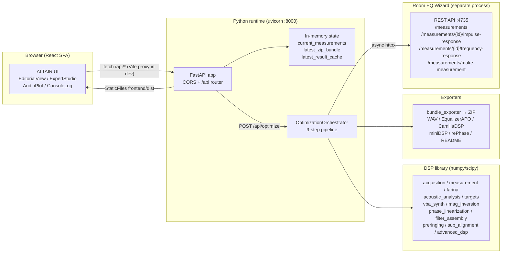

# ALTAIR — Complete System & Algorithmic Architecture

**Automated Linear-phase Tuning & Acoustic Inversion Routine**
Version 1.0.0 · Repository: `AutomaticDigitalRoomeq` · This document describes the **implemented** system, verified against the current source tree (backend `auto_roomeq/`, frontend `frontend/`, tests `tests/`).

---

## Table of Contents

1. [Executive Summary & Core Mission](#1-executive-summary--core-mission)
2. [Repository Map](#2-repository-map)
3. [Technology Stack](#3-technology-stack)
4. [Runtime & Deployment Architecture](#4-runtime--deployment-architecture)
5. [Backend Server Layer](#5-backend-server-layer)
   - 5.1 FastAPI App Bootstrap
   - 5.2 Process-Wide State
   - 5.3 REST Endpoint Catalogue
   - 5.4 Pydantic Schema Contract
6. [Optimization Orchestrator (1-Click Pipeline)](#6-optimization-orchestrator-1-click-pipeline)
7. [DSP Data Model & Core Utilities](#7-dsp-data-model--core-utilities)
8. [Signal Acquisition & Ingestion](#8-signal-acquisition--ingestion)
9. [Farina Distortion Separation, SNR Masking & Mic Calibration](#9-farina-distortion-separation-snr-masking--mic-calibration)
10. [Acoustic Intelligence Engine](#10-acoustic-intelligence-engine)
11. [Target (House) Curve Generator](#11-target-house-curve-generator)
12. [Module 1 — Virtual Bass Array (VBA)](#12-module-1--virtual-bass-array-vba)
13. [Module 2 — Regularized Magnitude Inversion](#13-module-2--regularized-magnitude-inversion)
14. [Module 3 — Crossover & Excess-Phase Linearization](#14-module-3--crossover--excess-phase-linearization)
15. [Filter Assembly, Tap Trimming & Headroom](#15-filter-assembly-tap-trimming--headroom)
16. [Safeguards: Pre-Ringing, Zwicker Masking, True-Peak](#16-safeguards-pre-ringing-zwicker-masking-true-peak)
17. [Subwoofer Alignment & Multi-Sub Optimization](#17-subwoofer-alignment--multi-sub-optimization)
18. [Advanced DSP Library (Support Functions)](#18-advanced-dsp-library-support-functions)
19. [Export Ecosystem](#19-export-ecosystem)
20. [Room EQ Wizard (REW) Integration](#20-room-eq-wizard-rew-integration)
21. [Frontend Architecture](#21-frontend-architecture)
22. [Data Contracts & Example Flow](#22-data-contracts--example-flow)
23. [Automated Test Suite](#23-automated-test-suite)
24. [How to Run, Build & Package](#24-how-to-run-build--package)
25. [Robustness, Security & Performance Notes](#25-robustness-security--performance-notes)
26. [Implemented vs. Design-Intent (Known Gaps)](#26-implemented-vs-design-intent-known-gaps)
27. [Appendix: Default Constants](#27-appendix-default-constants)

---

## 1. Executive Summary & Core Mission

**ALTAIR** is a browser-based, automated Digital Room Correction (DRC) suite. It ingests acoustic measurements (Room EQ Wizard via its local REST API at `http://localhost:4735`, uploaded REW text/FRD exports, uploaded WAV impulse responses, or a synthetic demo room), runs a **three-module DSP pipeline**, validates the result with psychoacoustic safeguards, and packages ready-to-deploy filters for Equalizer APO, CamillaDSP, miniDSP, rePhase, and generic WAV convolvers in one ZIP download.

The acoustic problems addressed:

| Phenomenon | Band | Effect |
| :--- | :--- | :--- |
| Axial room modes (standing waves) | 20–150 Hz | +15 dB resonant peaks, deep boundary nulls |
| Boundary/cancellation dips (SBIR) | 40–300 Hz | Non-minimum-phase nulls that cannot be EQ-boosted |
| Crossover phase rotation (e.g. LR4 = 360°) | 200 Hz–5 kHz | Smearing of transients, combing at the crossover |
| Early reflections / room decay | 100 Hz–20 kHz | Coloration, phase distortion, loss of imaging |
| Mic diffraction + atmospheric absorption | 2–20 kHz | Measurement artifacts / HF tilt in large rooms |

The pipeline is *corrective-but-conservative*: boosts are capped at **+5 dB**, cuts to **−20 dB**, pre-ringing is validated against a **10 %** amplitude / **−20 dB** energy threshold, inter-sample peaks are checked via **ITU-R BS.1770 4× oversampling**, and every correction that touches a non-minimum-phase boundary null (SBIR) is flagged instead of boosted.

> **Terminology note:** The repository also contains `README.md`, `Information.md`, and `ARCHITECTURE_ANALYSIS.md` (this file). `Information.md` is an early *design proposal* (Tauri/Rust, roadmap); the implemented product is Python/FastAPI + React/Vite as described here.

---

## 2. Repository Map

```
AutomaticDigitalRoomeq/
├── auto_roomeq/                    # Python backend package (setuptools package "auto-roomeq")
│   ├── __init__.py                 # package docstring
│   ├── main.py                     # CLI entry point (argparse + uvicorn + browser launch)
│   ├── orchestrator.py             # OptimizationOrchestrator: the 9-step 1-Click pipeline + demo data
│   ├── dsp/                        # DSP / acoustics library (pure NumPy/SciPy, no I/O)
│   │   ├── __init__.py             # public re-exports (the package API surface)
│   │   ├── measurement.py          # Measurement model, alignment, averaging, parsers
│   │   ├── acquisition.py          # log chirp generator, deconvolution, .cal loader, coherent stacking, Farina sweep ingestion
│   │   ├── farina.py               # Farina harmonic separation, SNR mask, polar mic calibration
│   │   ├── mdat_parser.py          # best-effort REW .mdat bridge (ZIP text export + Java-serialization double[] tokenizer)
│   │   ├── acoustic_analysis.py    # Schroeder, reflection gap/FDW, rolloff, EB smoothing, SBIR, ISO 9613-1 (+target adaptation), mic geometry, HW crossover snap, gain staging
│   │   ├── targets.py              # Harman / B&K 1974 / flat / OCA / custom house curves + RMS anchoring
│   │   ├── vba_synth.py            # Module 1: modal detection + VBA anti-pulse kernel
│   │   ├── mag_inversion.py        # Module 2: Tikhonov inversion + minimum-phase extraction
│   │   ├── phase_linearization.py  # Module 3: 1-cycle FDW, crossover all-pass reversal, low-Q unwrap
│   │   ├── preringing.py           # Step/impulse pre-ringing evaluator + Zwicker masking + auto-attenuate loop
│   │   ├── filter_assembly.py      # Final convolution, Tukey tap trimming, preamp headroom
│   │   ├── sub_alignment.py        # Sub↔mains delay/polarity grid search + multi-sub matrix optimizer
│   │   └── advanced_dsp.py         # speed of sound, beta(f), homomorphic split, group-delay XO detection, true-peak, hybrid IIR+FIR, warped FIR, time-reversed excess phase
│   ├── exporters/
│   │   ├── __init__.py
│   │   ├── bundle_exporter.py      # ZIP packaging (orchestrates all exporters + README)
│   │   ├── wav_exporter.py         # 32/64-bit float WAV FIR
│   │   ├── equalizer_apo_exporter.py
│   │   ├── camilladsp_exporter.py
│   │   ├── minidsp_exporter.py     # FIR coeff text + biquad text + hybrid IIR+FIR setup project
│   │   └── rephase_exporter.py     # .rephase XML project
│   ├── integrations/
│   │   └── rew_api.py              # RewApiClient (httpx async) for REW REST API
│   └── server/
│       ├── app.py                  # FastAPI app, CORS, favicon, static serving
│       ├── routes.py               # 17 REST endpoints incl. SSE stream + session persistence (APIRouter prefix=/api)
│       └── schemas.py              # Pydantic request/response models
├── frontend/                       # React 18 + TypeScript + Vite 5 + Tailwind SPA
│   ├── index.html                  # fonts (Plus Jakarta Sans, JetBrains Mono), SVG favicon
│   ├── package.json / vite.config.ts / tailwind.config.js / postcss.config.js / tsconfig.json
│   ├── src/
│   │   ├── main.tsx                # ReactDOM.createRoot + StrictMode
│   │   ├── App.tsx                 # root state, theme, console logs, view routing
│   │   ├── index.css               # Tailwind directives + theme CSS vars
│   │   ├── api/client.ts           # typed fetch wrappers for every backend endpoint
│   │   ├── types/index.ts          # TS interfaces mirroring backend schemas
│   │   └── components/
│   │       ├── Header.tsx                 # brand, REW status, mode switch, console toggle, theme toggle
│   │       ├── EditorialView.tsx          # "Editorial Monograph" wizard view (charts + chapters)
│   │       ├── ExpertStudio.tsx           # "Expert Studio" configuration/measurement view
│   │       ├── StepProgress.tsx           # 8-stage progress checklist
│   │       ├── AudioPlot.tsx              # SVG magnitude/phase/step/sub plot tabs
│   │       ├── SubAlignmentView.tsx       # interactive sub delay/polarity simulator
│   │       ├── ExportCard.tsx             # ZIP download card
│   │       ├── ConsoleLog.tsx             # live terminal log (filters, autoscroll, copy)
│   │       ├── QuickRunCard.tsx           # 1-click run actions
│   │       └── AcousticIntelligenceBanner.tsx # diagnostic metrics panel
│   └── dist/                       # built SPA (git-ignored, served by FastAPI when present)
├── tests/                          # pytest suite — 11 files, 71 test functions
├── pyproject.toml                  # build + deps + console script
├── requirements.txt                # pip dependency list
├── README.md                       # user-facing overview
├── Information.md                  # legacy design proposal (Tauri/React roadmap)
└── ARCHITECTURE_ANALYSIS.md        # this document
```

Module dependency direction (acyclic): `server → orchestrator → (dsp + exporters + integrations)`; `dsp/__init__.py` is the single public face of the DSP library; `orchestrator` never imports `server` (so the pipeline can be driven headless).

---

## 3. Technology Stack

### Backend (Python ≥ 3.10)

| Layer | Library | Version | Role |
| :--- | :--- | :--- | :--- |
| Web framework | FastAPI | ≥ 0.100 | REST API, Pydantic validation, OpenAPI docs |
| ASGI server | uvicorn | ≥ 0.23 | HTTP server (`reload` supported in dev) |
| Validation | pydantic | ≥ 2.0 | Request/response schemas |
| Numerics | numpy | ≥ 1.24 | FFT, arrays |
| DSP | scipy | ≥ 1.11 | filters (`signal.butter`, `sosfilt`, `freqz`, `resample_poly`), windows, `find_peaks`, Hilbert |
| Audio files | soundfile | ≥ 0.12 | WAV read/write (`sf.write`, `sf.read`) |
| HTTP client | httpx | ≥ 0.25 | Async REW REST API client |
| HTTP (legacy) | requests | ≥ 2.31 | Declared; not used in current code paths |
| Audio I/O | sounddevice | ≥ 0.4.6 | Declared; **not used** — acquisition happens in REW or via file upload |
| Multipart | python-multipart | ≥ 0.0.6 | File upload endpoints |

### Frontend

| Layer | Library | Version | Role |
| :--- | :--- | :--- | :--- |
| UI | React | 18.3.1 | SPA |
| Language | TypeScript | 5.6.3 | strict type checking |
| Bundler | Vite | 5.4.10 | dev server (5173) + `dist/` build; `/api` proxy to `127.0.0.1:8000` |
| Styling | Tailwind CSS | 3.4.14 (+ autoprefixer 10.4, postcss 8.4) | utility classes, `class` dark mode |
| Icons | lucide-react | 0.453.0 | icon set |
| Utilities | clsx 2.1.1, tailwind-merge 2.5.4 | — | class composition |
| Fonts | Google Fonts | — | Plus Jakarta Sans (UI) + JetBrains Mono (terminal/metrics) |

### Build & Packaging

- `pyproject.toml`: setuptools build backend; package `auto-roomeq` (name `auto-roomeq`, version `1.0.0`); `requires-python = ">=3.10"`; console script **`auto-roomeq = auto_roomeq.main:main`**; optional `dev` extra installs `pytest >= 7.4`, `pytest-asyncio >= 0.21`.
- `requirements.txt`: same core deps (plus pytest) for pip-only installs.
- Frontend build: `npm run build` → `tsc && vite build` → `frontend/dist/` (git-ignored but served at runtime when present).

---

## 4. Runtime & Deployment Architecture



**Process model.** `python -m auto_roomeq.main` (or the `auto-roomeq` console script): parses `--host` (default `127.0.0.1`), `--port` (default `8000`), `--no-browser`, `--reload`; prints a startup banner; opens the default browser at `http://{host}:{port}` unless `--no-browser` or `--reload`; then runs `uvicorn.run("auto_roomeq.server.app:app", ...)`. One process, JSON-file-backed state (`altair_project.json`, optional; no database). REW is a **separate** user-launched process on port 4735 — ALTAIR never starts it.

**Single-file deployment.** All "hardware integration" is file-based: the ZIP produced by `/api/export/bundle` contains everything a user needs to configure their convolver. No audio playback/recording happens inside ALTAIR itself (that is REW's job).

---

## 5. Backend Server Layer

### 5.1 FastAPI App Bootstrap (`server/app.py`)

- `FastAPI(title="ALTAIR API", description=..., version="1.0.0")`.
- **CORS**: `allow_origin_regex=r"^https?://(localhost|127\.0\.0\.1)(:[0-9]+)?$"`, `allow_credentials=True`, all methods/headers — covers both the Vite dev server and the packaged frontend.
- `GET /favicon.ico` → 204 (always, not OpenAPI-visible).
- Mounts the router with prefix `/api` (`server/routes.py`).
- If `frontend/dist/` exists, mounts it at **`/`** with `StaticFiles(html=True)` — i.e. the production SPA is served by the same process. Because the static mount is registered *after* the API router, `/api/*` takes precedence (FastAPI matches mounted routers in registration order).

### 5.2 Process-Wide State (`server/routes.py`)

```python
rew_client            = RewApiClient()                       # singleton
orchestrator          = OptimizationOrchestrator(rew_client) # singleton
state_lock            = asyncio.Lock()                       # guards the globals below
current_measurements  = Dict[str, Measurement]               # keys: 'left' | 'right' | 'sub'
current_seat_sets     = Dict[str, List[Measurement]]         # per-channel seat positions (spatial weights)
current_sub_measurements = List[Measurement]                 # 2-4 subs for MSO
current_cal           = Optional[dict]                       # uploaded mic .cal (freqs/spl/phase)
latest_zip_bundle     = Optional[bytes]                      # last ZIP (or generated from demo)
latest_result_cache   = Optional[dict]                       # last OptimizationResponse as dict (no ZIP binary)
```

All mutation of these globals happens under `state_lock` (async lock, so concurrent requests serialize). State is **ephemeral unless persisted**: `POST /api/session/save` writes everything (IRs as float32 JSON arrays) to `altair_project.json` in the repo root (git-ignored); the file is restored at startup and kept fresh after every optimize once it exists.

### 5.3 REST Endpoint Catalogue

All endpoints are under `/api` and documented automatically at `/docs` (OpenAPI).

| # | Method & Path | Purpose | Key inputs | Output |
| :--- | :--- | :--- | :--- | :--- |
| 1 | `GET /api/status` | Health + REW connectivity probe | — | `StatusResponse` |
| 2 | `GET /api/rew/measurements` | List open measurements in REW | — | `{"measurements": [...]}`; 502 on failure |
| 3 | `POST /api/measurements/upload` | Upload one measurement (`WAV` IR, REW text/FRD/CSV, **`.mdat` bridge**, or **recorded sweep** with Farina separation) | multipart `file`, `channel` (`left/right/sub`), `sample_rate` (48000), `measurement_type` (`ir`\|`sweep`) | `{status, channel, name, sample_rate, points, measurement_type}`; 400 on parse failure |
| 4 | `POST /api/measurements/upload-repeated` | Upload N repeats of the same position → coherent sub-sample stacking (+10·log₁₀N dB SNR) | multipart `files[]`, `channel`, `sample_rate` | `{status, channel, name, repetitions, snr_improvement_db, sample_rate}` |
| 5 | `POST /api/measurements/upload-multi-seat` | Upload N seat positions → hybrid spatial average (vector < f_trans, RMS ≥ f_trans) **with continuous ERB smoothing**; individual seats retained for spatial variance weighting | multipart `files[]`, `channel`, `sample_rate`, `schroeder_freq` (300) | `{status, channel, name, seat_count, schroeder_transition_hz, erb_smoothing, sample_rate}` |
| 6 | `GET /api/measurements/auto-sweep` | Download a 24-bit WAV log sweep (10 Hz→min(24 kHz, 0.48·fs)) | `channel`, `duration_s` (0.5–60), `repetitions` (1–16), `include_timing_ref`, `sample_rate` (22050–192000) | `audio/wav` attachment `ALTAIR_Test_Sweep_{channel}_{sr}Hz.wav` |
| 7 | `POST /api/measurements/auto-sweep` | Trigger a sweep **in REW** if connected; otherwise return the standalone WAV | same as #6 | JSON `{status, mode: "rew_api", ...}` or WAV |
| 8 | `POST /api/measurements/auto-repeated-sweep` | Automated N× repeated sweep (REW mode or **simulated mode**), coherently stacked | `channel` (`left\|right\|sub\|all`), `repetitions` (1–16), `sweep_length` (128–1024), `sample_rate`, `use_simulation` | `{status, channel, mode, repetitions, snr_improvement_db, channels_measured, details}` |
| 9 | `POST /api/optimize` | The 1-Click optimization (see §6) | `OptimizationRequest` JSON | `OptimizationResponse` (+ caches ZIP/result) |
| 10 | `GET /api/optimization/latest` | Cached result of last run | — | `OptimizationResponse`; 404 if never run |
| 11 | `GET /api/export/bundle` | Download last ZIP; **auto-runs demo pipeline if none exists** | — | `application/zip` `ALTAIR_Filters_Export.zip` |
| 12 | `POST /api/sub-alignment/simulate` | Interactive sub-mains summation for the UI slider | form `delay_ms`, `polarity` (±1), `crossover_freq` | `{delay_ms, polarity, freqs, spl_sum_db, spl_main_only_db, spl_sub_only_db}` (20–500 Hz) |
| 13 | `POST /api/measurements/upload-cal` | Upload microphone `.cal` curve — applied to H(f) at ingestion | multipart `file` | `{status, points, has_phase, frequency_range_hz}` |
| 14 | `POST /api/measurements/upload-multi-sub` | Upload 2–4 subwoofer measurements for MSO | multipart `files[]`, `sample_rate` | `{status, sub_count, names}` |
| 15 | `POST /api/optimize/stream` | **SSE live-streamed** optimization (`event: progress` … `event: result` / `event: error`) | `OptimizationRequest` JSON | `text/event-stream` |
| 16 | `GET /api/session` / `POST /api/session/save` / `load` / `clear` | JSON project persistence to `altair_project.json` (auto-restored at startup; auto-saved after optimize once a session file exists) | — | `{file_exists, path, channels, seat_sets, sub_measurements, cal_loaded, result_cached}` etc. |

**Input selection precedence in `/api/optimize`** (exact order):
1. `use_demo_measurements = true` → `generate_demo_room_measurements()` (48 kHz, 65536 FFT).
2. `rew_measurement_ids: [L, R?, Sub?]` → `rew_client.get_measurement_data(id)` for each.
3. Uploaded measurements in `current_measurements` (`left`, then `right` (falls back to left), then `sub`).
4. Auto-pull from REW: list measurements, take ids 1/2/3.
5. Otherwise → HTTP 400 with a helpful message.

**Endpoint #8 simulated mode** synthesizes `repetitions` noisy copies of the demo IR with Gaussian noise σ = 0.002, stacks them, and reports `baseline_snr_db`, `final_snr_db`, `rejection_rate_pct`, `accepted_count` — useful for CI/demos and for the frontend's "auto-measure" workflow when REW is offline.

### 5.4 Pydantic Schema Contract (`server/schemas.py`)

| Model | Fields (defaults / validation) |
| :--- | :--- |
| `StatusResponse` | `app="ALTAIR"`, `version="1.0.0"`, `rew_connected: bool`, `rew_base_url: str`, `rew_message?` |
| `TargetConfig` | `name="harman"` (`harman|bk1974|flat|oca|custom`), `bass_boost_db=6.0`, `bass_cutoff_hz=80.0`, `hf_slope_db_per_oct=-0.8`, `hf_start_hz=200.0` |
| `OptimizationRequest` | `target` (default factory), `crossover_freq_hz=2500` (10–20000), `crossover_order=4` (1–8), `sub_crossover_freq_hz=80` (20–500), `target_taps=65536` (1024–131072), `temperature_celsius=20` (−20–60), `relative_humidity_pct=50` (0–100), `pressure_kpa=101.325` (50–120), `listening_distance_m=3.0` (0.1–30), `mic_orientation_deg=0` (0–90; 0 = on-axis, 90 = ceiling/diffuse), `wfir_taps=None` (512–16384; Warped-FIR export), `use_demo_measurements=False`, `rew_measurement_ids?` |
| `PlotData` | `freqs`, `spl_before_left`, `spl_target_left`, `spl_filter_left`, `spl_after_left`, `phase_before_deg`, `phase_after_deg`, `step_time_ms`, `step_response` (all `List[float]`) |
| `AcousticIntelligence` | Schroeder Hz, reflection gap ms, FDW cycles, L/R rolloff, recommended sub XO, detected crossovers, speed of sound, temp/RH/pressure, air-absorption @10 kHz, SBIR diagnostics, microphone geometry, HW crossover snap, split gain staging, **mic_calibration, spatial_variance_weighting, target_air_adaptation_db_10k, sbir_neutral_mask_frequencies, wavelet_decay_gating** |
| `SubAlignmentResult` | `optimal_delay_ms`, `optimal_delay_samples`, `optimal_polarity`, `polarity_multiplier`, `crossover_freq_hz`, `gain_improvement_db`, `freqs`, `spl_unaligned_db`, `spl_aligned_db`, `spl_main_only_db`, `spl_sub_only_db` |
| `OptimizationResponse` | `status`, `sample_rate`, `target_taps`, `global_preamp_db`, `acoustic_intelligence?`, `modal_info_left/right`, **`modal_decay_left/right?`**, `preringing_left/right`, `zwicker_masking_left/right?`, **`safeguard_loop?`, `safeguard_decision_left/right?`**, `sub_alignment?`, **`multi_sub_alignment?`, `wfir_taps?`**, `true_peak_left/right_dbfs?`, `plots` |

> The ZIP bytes are intentionally **not** part of the response model — they are cached separately (`latest_zip_bundle`) and served by `/api/export/bundle`.

---

## 6. Optimization Orchestrator (1-Click Pipeline)

`orchestrator.py` defines:

- `generate_demo_room_measurements(sample_rate=48000, n_fft=65536) -> (left, right, sub)` — a synthetic audiophile room with: base slope `85 − 0.7·log₂(f/100)` dB; **Left**: 43 Hz +9 dB (P1), 84 Hz +6.5 dB (P2), 62 Hz −12 dB (D1), 180 Hz −4 dB floor bounce, 4th-order LR phase at 2.5 kHz (`−4·2·atan(f/2500)`), 38 Hz low rolloff; **Right**: 44.5/86/60/195 Hz variants; **Sub**: 18–140 Hz bandpassed, 35 Hz +4 dB, 43 Hz +8 dB, linear 3.2 ms acoustic delay.
- `OptimizationOrchestrator(rew_client=None)` — constructs `RewApiClient()` by default.
- `async run_pipeline(meas_left, meas_right=None, meas_sub=None, target_curve_name="harman", ... progress_callback=None) -> dict` — the heart of the app.

### Pipeline stage-by-stage (with progress callback percentages)

| Step | Progress | What happens |
| :--- | :--- | :--- |
| 1. Ingestion & timing | "Input Ingestion" 10–18 % | `calculate_speed_of_sound(T)`; **mic `.cal` application** (`apply_cal_file`, mag+phase) when uploaded; if `mic_orientation_deg > 10` → `apply_polar_diffraction_calibration`; `cross_correlate_align(right→left)` + IR correlation; `compute_snr_mask(15 dB)` per channel |
| 2. Acoustic intelligence | "Acoustic Intelligence" 25 % | Schroeder, reflection gap/FDW cycles, speaker rolloff (−6 dB), HW crossover snap, SBIR classification, ISO 9613-1 air-loss curve, group-delay crossover detection; **multi-seat spatial variance weights** W(f) built from retained seat sets |
| 3. Target synthesis | "Target Synthesis" 35 % | House curve by name; 300–1000 Hz RMS anchoring; **ISO 9613-1 air-absorption target adaptation** (target bent down by the air-loss curve, blend-in 1–4 kHz) |
| 4. Module 1 (VBA) | 48 % | `synthesize_vba_filter` per channel; **wavelet modal decay analysis** (RT60 ≥ 300 ms = true mode) and **SBIR hard-clamp neutral masks** built here |
| 5. Sub integration (MSO) | "Subwoofer Integration" 56 % | 1 sub → `optimize_sub_mains_alignment`; 2–4 subs → `optimize_multi_sub_matrix` (per-sub delay/gain/polarity) |
| 6–8. Closed-loop Modules 2+3 & safeguards | 62→72→84 % (85 % = retry notice) | **Retry loop (≤5)**: `synthesize_mag_inversion_filter(beta=0.04·β_scale, spatial weights W(f), forced neutral mask)` → `synthesize_phase_linearization_filter(max_delta_deg=45°·q_scale, regularized excess-phase inversion ≤500 Hz)` → `assemble_final_filter` (Tukey α=0.05) → pre-ringing + Zwicker. **Zwicker audibility gate**: audible pre-echo = pre-ringing failed ∧ not masked; retry scales `q ×0.8`, `β ×1.3`. True-peak (ITU-R BS.1770 4×) once on the final attempt; `global_preamp_db = min(preamp_l, preamp_r)` |
| 9. Diagnostics + packaging | 96–100 % | Mic geometry (+IR correlation), split gain staging; decay-gated hybrid IIR+FIR split (biquads only from true modes, max 8, Q 3.5) + 4096-tap compact FIR; optional **WFIR** synthesis (512–16384 taps); `create_export_bundle(...)` |

### Result object (back to UI)

```python
{
  "status": "success", "sample_rate": int, "target_taps": int, "global_preamp_db": float,
  "acoustic_intelligence": {...§5.4/§10...},
  "modal_info_left/right": {...§12...},
  "preringing_left/right": {...§16...},
  "zwicker_masking_left/right": {...§16...},
  "sub_alignment": {...§17...} | None,
  "zip_bundle_bytes": bytes,                     # not serialized into API response
  "true_peak_left/right_dbfs": float,
  "plots": {
    "freqs": 500 log-spaced 20–20000 Hz,
    "spl_before_left": measured SPL interp,
    "spl_target_left": anchored target interp,
    "spl_filter_left": 20·log10|RFFT(fir_final)| interp,
    "spl_after_left": before + filter,
    "phase_before_deg": meas_left phase (wrapped),
    "phase_after_deg": meas_h3_l phase (wrapped),
    "step_time_ms": (−25…+35 ms around argmax|fir|),
    "step_response": cumsum(fir) normalized to ±1,
  }
}
```

The pipeline runs in a worker thread (`asyncio.run` wrapper inside `run_in_executor`) for the **SSE endpoint** `POST /api/optimize/stream`, which pushes `progress` events through a thread-safe `asyncio.Queue` and streams them to the UI in real time (`event: progress` with step/pct/detail, then `event: result` or `event: error`); the plain `/api/optimize` remains for non-streaming clients.

---

## 7. DSP Data Model & Core Utilities

### `Measurement` (`dsp/measurement.py`)

The universal container: `(name, ir, sample_rate, n_fft)`. On construction it computes everything eagerly:

- `freqs = rfftfreq(n_fft, 1/fs)`; `H = rfft(ir, n_fft)`.
- `spl_db = 20·log10(max(|H|, 1e-12))`.
- `phase_rad/deg`, `unwrapped_phase_rad/deg` (`np.unwrap`).
- `group_delay_ms = −d(unwrapped phase)/dω · 1000`.
- `step_response = cumsum(ir)`, plus max-normalized version; `peak_idx`, `peak_time_ms`.
- Defensive: empty IR → 4096 zeros; non-finite samples → `nan_to_num`; `n_fft` defaults to next-power-of-2 ≥ max(4096, len(ir)).
- `get_spl_interpolated(freqs)` and `get_phase_interpolated(freqs, unwrapped=True)` for resampling onto the UI grid.

### Alignment & averaging

| Function | Algorithm |
| :--- | :--- |
| `cross_correlate_align(ref, target, fs, max_lag_ms=50, enable_subsample=True)` | FFT cross-correlation, search window ±50 ms, **3-point parabolic sub-sample interpolation** (δ clipped ±0.5 samples), then fractional-delay shift via `H·exp(−j2πf·τ/Fs)` on an `n_shift_fft = max(2·len, 8192)` grid. Returns `(aligned_ir, lag_samples_float, lag_ms)` |
| `vector_average(list)` | Cross-correlate-aligns each to the first, complex mean in frequency domain, `irfft`, trims to max IR length |
| `rms_magnitude_average(list)` | Power average: `10·log10(mean(10^(SPL/10)))` on a common grid (interpolated if n_fft/fs differ) |
| `hybrid_spatial_average(list, f_trans=300)` | Vector average below f_trans, RMS average above, blended by a sigmoid of width `max(50, f_trans·0.2)`; combined magnitude is converted to **minimum phase** via real-cepstrum liftering before `irfft` — so the average has no synthetic pre-ringing |

### Parsers

- `parse_rew_text(content_or_path, sample_rate=48000, name, n_fft=65536)` — REW text exports: skips `*`/`#`/`;` comments, splits on spaces/commas/tabs, accepts `freq, SPL[, phase]` rows, sorts, interpolates onto the FFT grid, reconstructs complex H, `irfft`.
- `load_wav_ir(file_bytes|path|BytesIO, name)` — `soundfile` read; multichannel → first channel; returns `Measurement`.

---

## 8. Signal Acquisition & Ingestion (`dsp/acquisition.py`)

| Function | Behavior |
| :--- | :--- |
| `generate_log_chirp(f_start=10, f_end=24000, fs=48000, length=2^20≈21.845 s, fade_in/out=2048, include_timing_ref=True)` | Instantaneous phase `φ(t) = 2π·f_start·duration/ln(f_end/f_start)·((f_end/f_start)^(t/duration) − 1)`; Hann tapers at both ends; optional **acoustic timing reference**: 10 ms 8 kHz sine burst with Hann envelope + 100 ms silence **prepended** (used to synchronize playback↔mic in REW). Returns `(sweep, t)` |
| `deconvolve(recorded, test, eps=1e-6)` | Regularized spectral division `H(f) = Y·X* / (|X|² + ε·max|X|²)`, next-power-of-2 FFT, returns RIR |
| `load_cal_file(content_or_path)` | Parses mic `.cal` (freq, SPL[, phase]); returns sorted `(freqs, spl, phase|None)`; fallback flat cal `[20, 20000] Hz / 0 dB` |
| `apply_cal_file(H, fft_freqs, cal_freqs, cal_spl, cal_phase=None)` | `H_calibrated = H / H_mic(f)` (magnitude and optional phase) — corrects the mic's own coloration |
| `coherent_impulse_stack(impulses, fs, min_correlation_threshold=0.80, return_diagnostics=False)` | **Reference-candidate search**: for each repeat used as the reference, sub-sample align all others and compute a direct-sound-window (5 ms pre / 25 ms post peak) correlation; accept if ≥ 0.80; if < 2 accepted, fall back to any correlation > 0.05; pick the candidate whose stack maximizes estimated SNR (`estimate_snr` = peak² / pre-arrival-mean² in dB); returns `(stacked_ir, snr_gain=10·log10(accepted), diagnostics)` with `accepted_count`, `rejection_rate_pct`, `baseline/final/theoretical_max_snr_db`, `best_reference_index`, `correlation_scores` |
| `recorded_sweep_to_measurement(recorded, fs, f_start=10, f_end, n_fft=65536, max_harmonic=5)` | **Farina ingestion** (used by the upload endpoint when `measurement_type='sweep'`): synthesizes the matching reference chirp, `deconvolve`, then `farina_harmonic_separation` to window out the 2nd–5th harmonic bursts before returning the Measurement; diagnostics include `thd_percent` |

---

## 9. Farina Distortion Separation, SNR Masking & Mic Calibration (`dsp/farina.py`)

### 9.1 `farina_harmonic_separation(recorded, f_start=10, f_end=24000, fs, duration=21.845 s, max_harmonic=5)`

Farina deconvolution: builds the time-reversed amplitude-modulated inverse sweep (amplitude ∝ 1/instantaneous frequency), convolves via FFT, then:

- Harmonic peak offsets: $\Delta t_k = -\frac{T}{\ln(f_{end}/f_{start})}\ln(k)$ for k = 2…5 (each isolated in a ±20 ms window → `harmonics["harmonic_k"]`).
- The linear IR is produced by zeroing everything **before** `peak − 3 ms` and applying a 2 ms half-Hann fade-in at the boundary (avoiding a step discontinuity).
- Returns `{linear_ir, harmonics, thd_percent}` where THD = `√(ΣE_harmonic / E_linear)·100` (capped at 100).
- **Not called by the current pipeline** (see §26) — it is library code covered by tests.

### 9.2 `compute_snr_mask(ir, fs, min_snr_db=15, noise_window_ms=100)`

- Signal window: 200 ms after the |IR| peak; noise window: first `noise_window_ms` of the recording (or the tail when the peak is too early).
- `SNR(f) = 10·log10(|H_sig|²/|H_noise|²)`, smoothed with a 15-tap moving average.
- Sigmoid correction mask: `mask(f) = 0.5·(1 + tanh((SNR(f) − min_snr_db)/4))` → 1.0 where SNR ≥ 15 dB, 0 where noise dominates.
- Returns `(freqs, snr_db, mask)`; the mask is fed into Module 2 so the inverter won't boost noise.

### 9.3 `apply_polar_diffraction_calibration(H, freqs, orientation_deg)`

- On-axis (|θ| ≤ 5°) → passthrough.
- Else applies an empirical ½"/¼" condenser capsule loss curve: 0 dB ≤ 2 kHz, then `−1.35·(log2(f/2000))^1.3` dB (≈ −2.2 dB @10 kHz, −4.5 dB @20 kHz), scaled by `sin(θ)`.
- Compensates so that 90° (ceiling/diffuse) measurements read like 0° free-field.

---

## 10. Acoustic Intelligence Engine (`dsp/acoustic_analysis.py`)

| Function | Algorithm / Formula | Key defaults |
| :--- | :--- | :--- |
| `log_smoothed_fast(data, freqs, fraction=3, variable=False)` | O(N)-cumsum fractional-octave smoothing; `variable=True` sweeps 1/48-oct ≤100 Hz → 1/3-oct ≥10 kHz | fraction 3 = 1/3-oct |
| `erb_smoothed_fast(data, freqs)` | Moore & Glasberg (1983): `ERB(f) = 24.7·(4.37·f/1000 + 1)` | — |
| `detect_schroeder_statistical(mag, freqs, fs, min_f=80, max_f=600, window_oct=0.25)` | 1) Sub-only shortcut: if median(40–80 Hz) − median(300–600 Hz) > 25 dB → 200 Hz. 2) Sliding ±1/8-oct std-dev of the spectrum; 4-oct-smoothed variance curve; baseline = 25th percentile of variance above 450 Hz; threshold = baseline + max(0.35, 1.25·σ_spread); scan downward for a **3-point sustained exceedance**; clip to [120, 450] Hz | fallback 220 Hz |
| `detect_reflection_gap(ir, fs, threshold_ratio=0.15)` | Hilbert envelope, 0.5 ms box-smooth; find peak, then first dip below 15 % of peak, then next rise above → gap; clipped [0.5, 20] ms | fallback 5 ms |
| `ir_gap_to_fdw_cycles(gap_s, reference_freq=500)` | `cycles = gap_s·500`, clipped [3.0, 10.0] | — |
| `detect_speaker_rolloff(mag, freqs, threshold_db=−6, ref 200–2000 Hz)` | 1/3-oct-smoothed; midband mean = reference; scan down/up for first crossing → `(low_clip[20,250], high_clip[10000,24000])` | — |
| `compute_spatial_variance_weight(mes, freqs, threshold_db=3)` | `W(f) = 1/(1 + (std_across_seats/3)²)` ∈ (0,1]; 1 where seats agree | if <2 mes → ones |
| `analyze_wavelet_modal_decay(ir, fs, modal_freqs, rt60_threshold=300 ms)` | Per modal freq: 4th-order bandpass (±15 %, 10 Hz…0.45 fs), Hilbert envelope, linear regression over the −5…−25 dB segment → RT60 (clip 20–2000 ms); true mode iff RT60 ≥ threshold. Distinguishes ringing modes from instant-death boundary nulls | default freqs [40,60,80,100,120,150] |
| `calculate_iso9613_air_absorption(freqs, T=20, RH=50, P=101.325, dist=3)` | ISO 9613-1 / ANSI S1.26: saturation pressure `p_sat_ratio = 10^(−6.8346·(T01/Tk)^1.261 + 4.6151)`, humidity `h = RH·p_sat/p_r`, oxygen/nitrogen relaxation frequencies, `α(f) = 8.686·f²·(t1 + (Tk/T0)^−2.5·(t2+t3))` dB/m, multiplied by distance → total loss dB/curve | ref T0 = 293.15 K |
| `adapt_target_curve_from_rt60(base, freqs, rt60=0.40 s, hf_start=1000)` | `Δslope = clip(−0.8·(RT60−0.4), −0.6, +0.4)` dB/oct added above `hf_start` — live rooms steepen, dead rooms flatten | not wired into pipeline (§26) |
| `adapt_target_for_air_absorption(target, freqs, air_loss_db, max=6 dB, blend 1–4 kHz)` | **Active in pipeline**: bends the target down by `clip(air_loss, 0, 6)` dB (air absorption is reported positive) with a half-Hann blend-in — physical HF air damping is never re-boosted | — |
| `classify_sbir_boundary_cancellations(freqs, spl_db, ir, fs, c)` | `find_peaks(−SPL)` in 35–300 Hz (prominence 3, distance 5); for each dip: `d = c/(4·f)`; **SBIR null** ⇔ depth ≥ 4 dB **and** 0.3 ≤ d ≤ 2.5 m → recommendation "Do not boost (non-minimum phase)" | — |
| `calculate_microphone_geometry_offset(lag_ms, c=343.2, ref_distance=3.0, sub_delay_ms)` | Path difference = `c·lag`; mic off-center = path/2 (mm); L/R/Sub distances in m & ft (`×3.28084`); classifies `center` (≤ ±3 mm) / `left` / `right`; emits a human-readable `geometry_summary` | — |
| `calculate_snapped_crossover_pair(l_rolloff, r_rolloff, spl_l?, spl_r?, freqs?)` | Math average of L/R −6 dB rolloffs → snap to `[40,50,60,70,80,90,100,110,120,150,180,200]` Hz (AVR/active-monitor switches); RMS L/R error over ±1 octave around the snap; slope label "Linkwitz-Riley 24 dB/oct (LR4)" | — |
| `calculate_split_gain_staging(target_attenuation_db, step=0.5)` | Hardware coarse = `round(attn/0.5)·0.5` dB; DSP fine trim = remainder (e.g. −5.32 dB → HW −5.5 dB, DSP +0.18 dB) to preserve DAC dynamic range | — |

---

## 11. Target (House) Curve Generator (`dsp/targets.py`)

All curves are returned in dB relative to 0 dBFS-scale SPL and are later **anchored** to the measurement level.

| Curve | Shape |
| :--- | :--- |
| `generate_harman_target(freqs, bass_boost_db=6, bass_cutoff=80, hf_slope=−0.8, hf_start=200)` | +boost shelf ≤ cutoff; linear-in-log transition cutoff→hf_start; `hf_slope` dB/oct above hf_start |
| `generate_bk1974_target(freqs)` | +3 dB ≤ 50 Hz; taper to 0 dB by 100 Hz; flat 100–2000; −0.9 dB/oct above 2 kHz |
| `generate_flat_target(freqs)` | zeros |
| `generate_oca_target(freqs)` | +5.5 dB ≤ 90 Hz; taper to 500 Hz; −0.65 dB/oct above |
| `generate_custom_target(...)` | delegates to Harman generator with user sliders |
| `anchor_target_to_measurement(target, measured_spl, freqs, (300,1000))` | `offset = mean(measured[band]) − mean(target[band])`; returns `(target+offset, offset)`; band falls back to (100,2000) then everything |

---

## 12. Module 1 — Virtual Bass Array (VBA) (`dsp/vba_synth.py`)

### 12.1 `detect_modal_peaks_dips(freqs, spl_db, f_min=20, f_max=150, prominence=2.5, tolerance=0.10, room_length_m=None)`

1. `scipy.signal.find_peaks` / `find_peaks(−spl)` in 20–150 Hz (prominence 2.5 dB, min distance 3).
2. Fundamental estimate: `f₁ = c/(2L)` if room length given, else lowest prominent peak in 25–70 Hz, else first peak, else 45 Hz.
3. **±10 % harmonic verification**: peak matches harmonic k iff `(1−0.10)·k·f₁ ≤ f ≤ (1+0.10)·k·f₁` (flagged `is_harmonic_match`); dips matched against `(k+0.5)·f₁`.
4. `f_opt` = the matched fundamental peak; fallbacks deduce from the lowest peak.
5. Returns `{f_1, f_opt, peaks[], dips[]}`.

### 12.2 `synthesize_vba_filter(measurement, f_opt=None, ...)`

1. `T_target_ms = 1000/f_opt` (the round-trip modal period).
2. `f_cutoff = clip(3.5·f_opt, 30 Hz, 0.45·fs)`.
3. **4th-order Butterworth low-pass** (`signal.butter(4, f_cutoff)` — 24 dB/oct) → 2048-sample impulse response → **minimum-phase via real-cepstrum liftering** → **DC-gain normalization to 1.0**.
4. Group-delay compensation: `τ_LPF` measured at `f_opt` from the unwrapped minimum-phase spectrum; `T_shift = max(1 ms, T_target − τ_LPF)`; `d = round(T_shift · fs)` samples.
5. Kernel: $h_{VBA}[n] = \delta[n] - 0.5\cdot h_{LPF}[n-d]$ (length = max(4096, d + 2048)) — an attenuated, delayed inverted LPF pulse that cancels the reflected first axial-mode arrival.
6. Pre-filter: `h₁ = measurement.ir ⊛ h_vba` → new `Measurement("…(Post-VBA)")`; adds `T_target_ms`, `f_cutoff`, `T_shift_ms`, `d_samples` to the modal info dict.

> **Doc/implementation mismatch:** README's old flowcharts say "8th-order 48 dB/oct" while the code uses 4th-order (24 dB/oct) with a docstring explicitly describing the "4th-order 24 dB/oct" design and its group-delay compensation.

---

## 13. Module 2 — Regularized Magnitude Inversion (`dsp/mag_inversion.py`)

### 13.1 `tikhonov_magnitude_inversion(H₁, target_mag, freqs, beta=0.04, max_boost=5, max_cut=20, f_low=15, f_high=20000, snr_mask=None, spatial_weights=None)`

$$H_{inv}(f) = \frac{T(f)\,\overline{H_1(f)}}{|H_1(f)|^2 + \beta(f)\,|T(f)|^2 + 10^{-12}}$$

- `β(f)` comes from `compute_frequency_dependent_beta` (§18) when `β` is a scalar; when passed an array it is used verbatim.
- `spatial_weights` scale `β(f) /= clip(W, 0.1, 1.0)` (high cross-seat variance ⇒ heavier regularization ⇒ no sweet-spot over-fit). **Active in the pipeline** whenever multi-seat uploads were made.
- **Asymmetric clamping**: `clip(20·log10|H_inv|, −20, +5)` dB.
- **SNR masking**: `inv_db *= clip(snr_mask, 0, 1)` blends toward 0 dB EQ where the noise floor is high.
- **Forced neutral mask**: `forced_neutral_mask` bins are set to exactly 0 dB — the mathematical equivalent of `β(f) → ∞`. The orchestrator builds this mask from confirmed SBIR nulls and fast-decay (non-modal) dips found by the wavelet decay analysis.
- Boundary taper: below `f_low` multiply by `f/f_low`; above `f_high` force 0 dB.
- Returns the complex response (phase of the raw Tikhonov solution is kept purely as a magnitude carrier here — phase is discarded afterwards).

### 13.2 `extract_minimum_phase(mag_linear, n_fft)`

Real-cepstrum minimum-phase extraction:

- `log_mag = ln|H|` → two-sided mirrored spectrum → `cepstrum = ifft(...).real`
- Causal lifter: `win[0]=1, win[1:N/2]=2, win[N/2]=1`
- `H_min = exp(fft(cepstrum·win))[:N/2+1]`; `h_min = irfft(H_min, n_fft)`
- Guarantees causality → zero pre-ringing from this stage.

### 13.3 `synthesize_mag_inversion_filter(meas_h1, target_spl_db, beta=.04, max_boost=5, max_cut=20, ...) `

Tikhonov → minimum-phase → `h₂ = h₁ ⊛ h_inv,min` → `Measurement("…(Post-MagInv)")`; returns `(h_inv_min, meas_h2, H_inv_mag_db)`.

---

## 14. Module 3 — Crossover & Excess-Phase Linearization (`dsp/phase_linearization.py`)

### 14.1 `frequency_dependent_window(ir, fs, cycles=1.0, min_win_ms=2, max_win_ms=500)`

FDW with window length `T(f) = cycles/f` per frequency:

- For each FFT bin, center a Tukey(α=0.5) window around the impulse peak of length `T(f)·fs` (clamped to 2 ms–500 ms), multiply the IR segment, and project onto the bin's complex sinusoid — i.e. an octave-style direct-sound estimate.
- `H_fdw[0] = H[0]` (DC); returns `(fdw_ir, H_fdw)`.

### 14.2 `synthesize_crossover_phase_reversal(fs, xo=2500, order=4, n_fft=65536)`

Analytical phase reversal of the Butterworth prototype (order/2 enough for LR):

$$H_{ap}(s) = \frac{A(-s)}{A(s)}, \quad H_{rev}(f) = \overline{H_{ap}(f)} \cdot e^{-j2\pi f \tau},\ \tau = \frac{N/2}{F_s}$$

- Implements `A(−s)` by alternating coefficient signs (`a_k·(−1)^(N−k)`); complex-safe denominator; Linear-phase carrier centers the impulse at N/2; Tukey(α=0.05) edge taper.

### 14.3 `synthesize_low_q_phase_correction(freqs, excess_phase, ...)`

Minimal low-Q phase wraps (< 250 Hz active, cosine **fade-out taper 250→500 Hz**), each clamped to ±45°:

`H_corr(f) = exp(j·(−clip(excess, ±45°)·taper(f)))` — deliberately low-Q to avoid Gibbs/step spikes.

### 14.4 `synthesize_phase_linearization_filter(meas_h2, crossover_freq=2500, order=4, apply_low_q=True, max_delta_deg=45, apply_excess_phase_inversion=False)`

1. 1-cycle FDW → `H_fdw`.
2. Compute **excess phase** = unwrap(angle(H_fdw)) − unwrap(angle(H_min)) where H_min comes from a cepstral minimum-phase reconstruction of the FDW magnitude.
3. `H_phase = RFFT(h_crossover) · H_low_q` (when enabled) and, with `apply_excess_phase_inversion=True` (**enabled in the pipeline**), additionally `· H_excess_inv` from `synthesize_regularized_excess_phase_inverse` — a bounded per-bin ±`max_delta_deg` phase-only inverse of the measured excess phase (active < 250 Hz, cosine fade 250–500 Hz, zero above). The bound guarantees no pre-echo; `max_delta_deg` is the knob the closed-loop safeguard scales down (Q ×0.8 equivalent).
4. `h_phase = irfft(...)·Tukey(α=0.05)`; `h₃ = h₂ ⊛ h_phase` → `Measurement("…(Linearized)")`.

---

## 15. Filter Assembly, Tap Trimming & Headroom (`dsp/filter_assembly.py`)

### `assemble_final_filter(h_vba, h_inv, h_phase, target_taps=65536, fs=48000, window_type="tukey", tukey_alpha=0.05, centering=0.50)`

1. `h_combined = fftconvolve(fftconvolve(h_vba, h_inv, 'full'), h_phase, 'full')`.
2. **Peak-centering**: place `argmax(|h_combined|)` at `target_taps·centering` (default 0.50 → linear-phase, centered; `0.20` = low-latency mode available).
3. Copy into an exact-length zero array (truncates/pads).
4. Edge taper: Tukey(α=0.05) (default) or Blackman-Harris 4-term.
5. `calculate_preamp_headroom(final_fir, fs, safety_margin_db=1.0)`:
   - Max spectral gain over 20 Hz–20 kHz (n_fft ≥ 65536).
   - `preamp = −(max_gain + 1.0) dB` if any positive gain, else `−1.0 dB`.

Returns `(final_fir, max_gain_db, recommended_preamp_db)`.

---

## 16. Safeguards: Pre-Ringing, Zwicker Masking, True-Peak

### 16.1 `evaluate_step_response_preringing(impulse, fs, t=[−20,−5] ms, max_amp=0.10, max_energy=−20 dB)`

- Peak-relative time axis; evaluation window −20…−5 ms.
- `pre_amp_ratio = max|h[window]| / max|h|` (threshold 10 %).
- Step response oscillation (baseline −30…−20 ms removed), ratio threshold same.
- Pre-impulse energy ratio `10·log10(E(t<−2ms) / E(t≥−2ms))` (threshold −20 dB).
- Returns `{passed, max_pre_amplitude, max_pre_amplitude_pct, impulse_pre_amplitude_pct, threshold_pct, pre_energy_db, energy_threshold_db, t_start_ms, t_end_ms, peak_idx}`.

### 16.2 `auto_attenuate_preringing(filter_gen_fn, initial_q=1.0, initial_beta=0.08, max_iterations=5)`

Iterative retry loop: `q ×= 0.80`, `beta ×= 1.30` per iteration until the evaluator passes; returns best impulse/metrics/final q/beta. **The orchestrator now implements this loop directly** (the library closure does not fit the two-channel pipeline): Modules 2+3 are re-run with `β ×1.3` and `max_delta_deg ×0.8` (Q-attenuation equivalent) up to 5 attempts, and the loop only retries when the pre-echo is *audible* — see the Zwicker gate below. Results surface as `safeguard_loop {attempts, q_scale, beta_scale, auto_attenuated}` and `safeguard_decision_left/right {pre_ringing_passed, zwicker_masked, audible_pre_echo, verdict}`.

### 16.3 Zwicker Audibility Gate (active)

`evaluate_zwicker_temporal_masking` is no longer a passive report: a failed pre-ringing evaluation counts as a **failure only when the pre-echo is not masked** by the Zwicker backward-masking curve (`audible_pre_echo = !pre_ringing_passed && !zwicker_masked`). Inaudible ringing is allowed to pass, and audible ringing triggers the §16.2 attenuation loop before the export bundle is generated.

### 16.3 `evaluate_zwicker_temporal_masking(impulse, fs)`

Backward-masking curve: `M(t) = −6 − 1.667·(|t_ms| − 2)` dB over −20…−2 ms (≈ −36 dB at −20 ms); threshold linearized; `worst_margin_db = 20·log10(max(pre_amp / thresh))`; `is_masked = margin ≤ 0`.

### 16.4 `calculate_itu_r_bs1770_true_peak(ir, oversample=4)`

`signal.resample_poly(ir, 4, 1)` → max |sample| → dBFS (−120 dBFS floor). Detects inter-sample peaks that would clip DAC reconstruction filters.

---

## 17. Subwoofer Alignment & Multi-Sub Optimization (`dsp/sub_alignment.py`)

### 17.1 `optimize_sub_mains_alignment(main_meas, sub_meas, crossover_freq=80, search_range_ms=50, crossover_order=4)`

1. Butterworth split at XO: `order/2` → LPF on sub, HPF on mains (`sosfilt`).
2. Focus band: 0.5·fc … 2·fc (≥20 Hz, ≤0.45·fs).
3. **Coarse grid search**: 201 delay candidates in ±50 ms × polarity {+1, −1}; objective `score = mean(SPL_sum) + 0.5·min(SPL_sum)` (reward total energy, penalize deep cancellations).
4. **Fine search**: ±10 samples around the coarse winner.
5. Produces the full 20–500 Hz unaligned/aligned/main-only/sub-only curves and `gain_improvement_db = mean(aligned) − mean(unaligned)`.

### 17.2 `optimize_multi_sub_matrix(sub_measurements, crossover_freq=80, search_range_ms=20)`

Sequential greedy MSO for 2–4 subs (sub 0 = reference at 0 ms/0 dB/+) :

- Resamples mismatched sample rates via `signal.resample_poly` (exact rational), guarantees `n_fft` covers the longest IR.
- For each subsequent sub: search 121 delays ±20 ms × polarity × gains {−4, −2, 0, +2} dB; score `mean(SPL) − 0.5·std(SPL)`; accumulates the optimized complex sum.
- Returns per-sub `{delay_ms, delay_samples, gain_db, polarity}` + `sub_count`.
- **Active in the orchestrator**: upload 2–4 sub measurements (`/api/measurements/upload-multi-sub`) and the pipeline routes them to the MSO path, reporting `multi_sub_alignment` and writing `miniDSP/multi_sub_alignment.json` into the ZIP. A single sub still uses the §17.1 single-sub optimizer.

---

## 18. Advanced DSP Library (Support Functions, `dsp/advanced_dsp.py`)

| Function | Purpose / Formula |
| :--- | :--- |
| `calculate_speed_of_sound(T)` | $c(T) = 331.3\sqrt{1 + T/273.15}$ m/s (used for SBIR distances and geometry) |
| `compute_frequency_dependent_beta(freqs, beta_0=0.04, f_low=25, f_high=18000, modal_beta_min=0.008)` | $\beta(f) = \beta_0\left(1 + (f_{low}/f)^4 + (f/f_{high})^4\right)$; additionally halved in 45–180 Hz core modal band; clipped [0.008, 10.0] — surgical in the bass, protective at subsonic/ultrasonic extremes |
| `homomorphic_mixed_phase_split(ir, n_fft)` | Real-cepstrum min-phase reconstruction; `H_ap = H / H_min`; returns `(h_min, h_ap)` — the h(t) = h_min ⊛ h_ap decomposition |
| `detect_group_delay_crossovers(ir, fs, (500,5000), min_prominence=0.02 ms)` | Unwrap phase → `τ_g = −dφ/dω` (ms) → linear-detrend → median filter → `find_peaks` (prominence 0.02 ms); fallback gradient method; returns `[{frequency_hz, group_delay_peak_ms, estimated_order}]` sorted |
| `calculate_itu_r_bs1770_true_peak` | see §16.4 |
| `generate_hybrid_iir_fir_split(modal_peaks_dips, target_fir, fs, max_biquads=8, target_taps=4096)` | RBJ Audio-EQ-Cookbook peaking biquads at the modal freqs (default Q 3.5, gains from the caller); `H_residue = H_target/H_iir` (magnitude + phase); `irfft` → peak-centered 4096-tap Tukey FIR. Returns `(biquads[{frequency_hz, gain_db, q, b0…a2}], compact_fir)` |
| `synthesize_warped_fir(target, freqs?, target_taps=4096, fs, λ?)` | WFIR / Laguerre: Smith & Abel λ ≈ `clip(1.0674·√((2/π)·atan(0.06583·fs_kHz)) − 0.1916, 0.40, 0.90)`; warped angular frequency $\tilde\omega = \omega + 2\arctan\frac{\lambda\sin\omega}{1-\lambda\cos\omega}$; resample magnitude (+min-phase option) or full complex response on the warped axis; trim + 5 % half-cosine tail fade — concentrates taps below 120 Hz. Library function |
| `synthesize_time_reversed_excess_phase_filter(ir, fs, max_corr_ms=20, f_max=500, target_taps=None)` | Homomorphic split → `H_inv_ap = conj(H_ap)` with a smooth 200 Hz blend to zero phase above f_max → × linear carrier (N/2) → window to ±20 ms Tukey(α=0.1) around center. Library function |

---

## 19. Export Ecosystem (`auto_roomeq/exporters/`)

### ZIP bundle layout (`bundle_exporter.create_export_bundle`)

```
ALTAIR_Filters_Export.zip
├── README_INSTALL.txt                     # setup guide (sample rate, taps, preamp, sub delay, WFIR & MSO notes)
├── WAV_Filters/
│   ├── ALTAIR_Stereo_FIR_32bit.wav        # 2-channel float32 (interleaved, equal-length padded)
│   ├── ALTAIR_Left_FIR_32bit.wav
│   ├── ALTAIR_Right_FIR_32bit.wav
│   ├── ALTAIR_WFIR_{taps}_Stereo.wav      # only when wfir_taps requested (embedded DSP targets)
│   ├── ALTAIR_WFIR_{taps}_Left.wav
│   └── ALTAIR_WFIR_{taps}_Right.wav
├── EqualizerAPO/
│   ├── config.txt
│   ├── ALTAIR_Left_FIR_32bit.wav
│   └── ALTAIR_Right_FIR_32bit.wav
├── CamillaDSP/
│   ├── camilladsp.yml
│   ├── ALTAIR_Left_FIR_32bit.wav          # FLOAT32LE conv files
│   └── ALTAIR_Right_FIR_32bit.wav
├── miniDSP/
│   ├── fir_coeffs_left.txt                # max 4096 taps, scientific notation, peak-centered
│   ├── fir_coeffs_right.txt
│   ├── biquad_coeffs_left.txt             # only if hybrid split produced biquads (true modes only)
│   ├── biquad_coeffs_right.txt
│   ├── ALTAIR_miniDSP_Setup.txt           # hybrid IIR+FIR deployment summary (PEQ slots + FIR slots)
│   └── multi_sub_alignment.json           # only in MSO mode: per-sub delay/gain/polarity
└── rePhase/
    └── ALTAIR_Project.rephase             # XML project (settings/gain/crossover/eq_bank)
```

### Format specifics

| Exporter | Key behaviour |
| :--- | :--- |
| `export_wav_fir(fir_left, fir_right=None, fs, subtype="FLOAT")` | `soundfile` WAV; `FLOAT` = 32-bit float, `DOUBLE` = 64-bit; stereo pads to equal length; returns bytes or writes to a path |
| `export_equalizer_apo_config(preamp, wav…, sub_delay, sub_polarity)` | `Preamp: {x} dB`; `Channel: L/R` + `Convolution:` lines; **delay logic**: sub delay > 0 → `Channel: LFE` + `Delay: x ms`; sub delay < 0 → mains compensation `Channel: L R` + delay; polarity < 0 → `Copy: LFE=-1*LFE` |
| `export_camilladsp_config(preamp, wav…, fs, channels=2, sub…)` | Valid YAML: `devices` (ALSA S32LE, capture/playback, chunksize 1024, queuelimit 4), `filters` (`preamp_gain` Gain, `fir_left/right` Conv File FLOAT32LE, optional `mains_delay`/`sub_delay` Delay ms, `sub_invert` Gain inverted), `pipeline` per-channel Filter nodes; channels auto-expanded to 3 when a sub is present |
| `export_minidsp_fir(fir, max_taps=4096)` | If longer than max_taps: peak-centered crop (with edge re-crop if near the end), pad, Tukey(α=0.05); lines like `{c:.10e}` |
| `export_minidsp_biquads(biquads)` | Header + `biquadN,` / `b0=…, b1=…, b2=…, a1=…, a2=…` (10 decimals) |
| `export_rephase_xml(fs, taps, xo, order, preamp, modal_freqs=None)` | ElementTree XML `<rephase version="1.4.3">` with `<settings>` (sample_rate, taps, window=tukey, centering=middle, format="float 32bit (.wav)"), `<gain><preamp>`, `<crossovers><crossover type="Linkwitz-Riley {order·6}dB/oct" kind="high-pass">`, optional `<eq_bank>` peak filters; pretty-printed with minidom |

---

## 20. Room EQ Wizard (REW) Integration (`integrations/rew_api.py`)

`RewApiClient(base_url="http://localhost:4735", timeout=5.0)` — async httpx.

| Method | REW call | Notes |
| :--- | :--- | :--- |
| `check_connection()` | `GET /measurements` | 200 → connected; `ConnectError` → helpful hint ("ensure REW is open with API enabled… or launched with `-api`") |
| `get_measurements()` | `GET /measurements` (+`/{id}` metadata when a bare ID list) | tolerant of list/dict formats |
| `get_measurement_data(id)` | `GET /measurements/{id}/impulse-response` first, fallback `GET /measurements/{id}/frequency-response` | IR: dict keys `impulseResponse/ir/samples/data/y`; **base64 big-endian float32 (`>f4`)** or numeric lists; `sampleRate`/`title` metadata. FR fallback: `startFreq` + `pointsPerOctave\|ppo` (log grid) or `freqStep` (linear), or explicit `frequencies`+`spl`, or `[{freq, spl}]`; reconstructs a **minimum-phase** IR via cepstrum at 65536 FFT / 48 kHz |
| `align_impulse_responses(ref_id, target_ids)` | `POST /measurements/align-impulse-responses` | delegates REW's alignment |
| `execute_trace_arithmetic(op, id_a, id_b=None)` | `POST /measurements/arithmetic` | A/B, 1/A, A+B; returns new measurement id |
| `trigger_measurement(name, sweep_length=512, start=10, end=24000, fs, level=−12 dBFS)` | `POST /measurements/make-measurement` (fallback `/measure`) | sweep_length in k-samples; 30 s extended timeout |
| `execute_auto_repeated_sweeps(channel, repetitions, sweep_length, fs)` | repeated `trigger_measurement` + up to 25 s polling (1 s interval) for new IDs, then per-ID `get_measurement_data` + `coherent_impulse_stack` | returns `{status, channel, repetitions_captured, snr_improvement_db, measurement, measurement_ids}`; raises if nothing captured |

---

## 21. Frontend Architecture

### 21.1 Entry & bootstrap

- `frontend/index.html` — loads Google fonts, sets `class="dark"` on `<html>`, inline SVG favicon, mounts `#root`, script `/src/main.tsx`.
- `src/main.tsx` — `ReactDOM.createRoot(...).render(<StrictMode><App/></StrictMode>)`.
- `src/index.css` — Tailwind directives + minimal custom CSS.

### 21.2 `App.tsx` — root state machine

| State | Type / initial | Notes |
| :--- | :--- | :--- |
| `status` | `StatusResponse \| null` | from `GET /api/status` |
| `mode` | `'wizard' \| 'expert'` | Editorial Monograph vs Expert Studio |
| `inputSource` | `'demo' \| 'rew' \| 'upload'` | drives `use_demo_measurements` |
| `isRunning` | bool | run-in-flight guard |
| `result` | `OptimizationResponse \| null` | set after `POST /api/optimize/stream` (SSE) with `/api/optimize` fallback |
| `progress` | `ProgressEvent \| null` | live SSE progress `{step, pct, detail}` — drives StepProgress bar + console `STAGE` lines |
| `error` | string \| null | banner |
| `showConsole` | bool (true) | right dock toggle |
| `theme` | `'dark' \| 'light'` | persisted to `localStorage['altair-theme']`, applied as `dark`/`light` class on `documentElement` (Tailwind `darkMode: 'class'`) |
| `logs` | `ConsoleLogEntry[]` | capped at **200 entries** (`prev.slice(-199)` + new) |
| `config` | `OptimizationRequest` | defaults: harman 6 dB / 80 Hz / −0.8 dB/oct / 200 Hz, XO 2500 LR4, sub XO 80, 65536 taps, demo mode |

- On mount: `checkStatus()` then **auto-runs the demo optimization once** (`initialRunRef` guard).
- `handleRun()`: calls `runOptimizationStreamed` (SSE parser, falls back to plain `/api/optimize`), logs every stage transition as `[pct%] step — detail`, and streams the result into the console with new diagnostic tags: `CAL` (mic .cal), `SBIR` (hard-clamped nulls), `ISO9613` (air-absorption target bend), `SPATIAL` (variance weighting), `MSO` (multi-sub), `GUARD` (safeguard verdict incl. Zwicker gate & auto-attenuation).
- Layout: sticky `Header`; main content (left: active view; right: `ConsoleLog` dock, sticky, `h-[calc(100vh-6.5rem)]`); mono-font footer with the ALTAIR tagline.

### 21.3 Components

| Component | Responsibility |
| :--- | :--- |
| `Header` | brand block, REW Online/Standalone badge (animated ping), refresh-status button, Mode switcher (Editorial Monograph / Expert Studio), Console toggle with count, dark/light toggle |
| `EditorialView` | **Wizard/monograph view**: serif headline + reference-hardware strip (Edifier MR3 + T5s), custom in-line SVG SPL chart (860×260, log-x 20–20 kHz, y 40–100 dB), repeated-sweep studio sub-panel, and a numbered "bento" of chapters: 01 Modal Mitigation & VBA, 02 Subwoofer Linkwitz-Riley Coherence, 03 Physical Geometry & Distances, 04 Target House Curve Profile, 05 Convolver Deployment & Export Package |
| `ExpertStudio` | Config density: input-source mode (demo/REW/upload), measurement mode (single/repeated/multi-seat) with file inputs for L/R/Sub, 1-Click automated repeated sweep studio (per-channel and FULL 2.1; `use_simulation = !rewConnected`), sweep download, target-curve sliders (curve name, bass boost/cutoff, HF slope/start), taps, XO freq/order, environment fields (temperature °C, RH %, mic orientation 0°/90° — pressure & listening distance exist in the API schema but have **no** UI control in this view), plus: mic `.cal` upload, **multi-sub MSO upload (2–4 files)**, **WFIR export toggle (4096 taps)**, **single-file type switch (IR vs recorded sweep → Farina)**, and the **Project Session card** (Save/Load/Delete-file/Status against `altair_project.json`) |
| `StepProgress` | 8-stage checklist (Timing/Ingestion, Target Anchoring, VBA, Magnitude Inversion, Phase Linearization, Sub Integration, Safeguards/Tap Trim, Packaging) with result-derived detail text (e.g. `P1 43.0 Hz, 4th-order 24dB/oct`) — now **live**: SSE progress events drive a percentage bar, active-stage highlight/spinner and completed checkmarks |
| `MultiSubView` | MSO result table: per-sub index/name/delay (ms+samples)/gain/polarity badge with deployment hint (sub #1 = reference) |
| `AudioPlot` | Tabbed SVG visualizer: magnitude (20–20 kHz, 40–105 dB, base + before/target/filter/after traces, ±1/3-oct grid), phase (±180°, −180…180 grid), step (−25…35 ms, −0.2…1.2), sub (20–500 Hz); visibility checkboxes; dark/light theme-aware colors |
| `SubAlignmentView` | post-run interactive sim: delay & polarity sliders → `POST /api/sub-alignment/simulate` → live summation curve overlay |
| `ExportCard` | CTA → `GET /api/export/bundle` (download via `getExportBundleUrl()`), shows preamp/sample-rate/taps |
| `ConsoleLog` | terminal-style stream: tag-based color coding, filter `all/geom/dsp/err`, auto-scroll pause, copy-to-clipboard, clear, collapse |
| `QuickRunCard` | 1-click triggers (run optimization, download bundle, auto-measure) |
| `AcousticIntelligenceBanner` | metric cards (Schroeder Hz, reflection gap ms + FDW cycles, speaker −6 dB rolloff, recommended sub XO), physical geometry (L/R/Sub distances m+ft, off-center mm, IR correlation %), HW crossover snap badge, split gain staging, auto group-delay crossovers, SBIR dips, true-peak dBTP |

### 21.4 API client (`src/api/client.ts`)

Typed wrappers: `fetchStatus`, `runOptimization`, `runOptimizationStreamed` (SSE parser with progress/result/error handlers + automatic fallback), `getExportBundleUrl`, `uploadMeasurementFile` (with `ir|sweep` type), `uploadCalFile`, `uploadMultiSubMeasurementFiles`, `simulateSubDelay`, `uploadRepeatedMeasurementFiles`, `uploadMultiSeatMeasurementFiles`, `getAutoSweepDownloadUrl`, `triggerAutoRepeatedSweep`, session helpers (`getSessionStatus`, `saveSession`, `loadSession`, `clearSession`), and `runRepeatedSweeps` (maps `'both' → 'all'`, renames backend fields to the editorial UI's expected names). All use relative `/api` paths — the Vite dev proxy forwards to `127.0.0.1:8000`, and in production the FastAPI static mount serves the SPA from the same origin (no CORS needed).

### 21.5 Theming

Tailwind `darkMode: 'class'`; the app toggles `dark`/`light` on `<html>`; `localStorage['altair-theme']` persists the choice; custom palette `dark.900…#0b0f19`, `audiophile.{cyan,emerald,amber,rose,indigo}`; light mode uses warm-paper tones (`#F9F8F6`). Graphs read the `theme` prop to switch grid/background/stroke colors.

---

## 22. Data Contracts & Example Flow

**1-Click demo run** (what the UI does on first load):

1. `GET /api/status` → `{app:"ALTAIR", version:"1.0.0", rew_connected:false, rew_base_url:"http://localhost:4735", rew_message:"Cannot connect to REW API…"}`.
2. `POST /api/optimize` with:
   ```json
   { "target": {"name":"harman","bass_boost_db":6.0,"bass_cutoff_hz":80.0,
                "hf_slope_db_per_oct":-0.8,"hf_start_hz":200.0},
     "crossover_freq_hz":2500.0,"crossover_order":4,"sub_crossover_freq_hz":80.0,
     "target_taps":65536,"use_demo_measurements":true }
   ```
3. Server resolves demo L/R/Sub, runs the 9 steps (verified: **status `success`**, 48 kHz / 65 536 taps, `preamp −4.75 dB`, true-peak ≈ **−3.3 dBTP**, Schroeder 236 Hz, reflection gap 0.62 ms → FDW 3 cycles, rolloff 63.7 Hz → sub XO 80 Hz, sub alignment −3.04 ms / inverted(+0.26 dB), pre-ringing & Zwicker both pass, ZIP ≈ 2.0 MB, 500 plot points).
4. `GET /api/export/bundle` → ZIP downloaded from the cached `latest_zip_bundle`.

**REW-authenticated workflow**: REW open with API enabled → UI polls status → user picks "Pull from REW" → `/api/optimize` with `rew_measurement_ids` or the automatic-pull path → same pipeline → bundle.

---

## 23. Automated Test Suite

`tests/` = **12 files, 89 test functions** (`pytest tests/ -q` collects 89).

| File | Focus |
| :--- | :--- |
| `test_dsp_core.py` | chirp/deconvolve/cal, Measurement, cross-correlation alignment, vector/hybrid averaging, REW text parser |
| `test_psychoacoustics_and_physics.py` | speed of sound, ISO 9613-1 absorption, SNR mask, Farina harmonic separation & offsets, polar diffraction, Zwicker masking, pre-ringing |
| `test_advanced_algorithms.py` | wavelet modal decay, intelligent stacking/outlier rejection (**seeded, deterministic**), mic geometry, crossover snap + gain staging, beta(f), warped FIR, homomorphic split, time-reversed excess phase |
| `test_orchestrator.py` | full demo pipeline: outputs, ZIP validity |
| `test_e2e_pipeline.py` | end-to-end measurement synthesis → optimize → bundle |
| `test_server_api.py` | status, optimize + export flow (TestClient), sub simulation, static SPA serving, auto repeated sweep |
| `test_edge_cases.py` | empty/degenerate inputs, NaN guards, tiny n_fft, sample-rate oddities |
| `test_fuzz_and_stress.py` | randomized parameters, large tap counts, numerical stability |
| `test_complete_feature_matrix.py` | every public DSP function smoke-tested |
| `test_code_review_bugfixes.py` | regression tests for past bugfixes |
| `test_all_functions_exhaustive.py` | exhaustive per-function contract checks |
| `test_enhancement_roadmap.py` | **new**: Farina sweep ingestion, forced-neutral masking, SBIR/decay gating, regularized excess-phase inverse, ISO target adaptation, ERB hybrid averaging, miniDSP hybrid export, orchestrator cal/spatial/safeguard wiring, MSO, WFIR bundle, `.mdat` ZIP + Java tokenizer, cal/multi-sub/session/SSE endpoints |

**Current status (verified):** `89 passed` — the previously flaky `test_intelligent_impulse_stacking_and_outlier_rejection` is now deterministic (`np.random.seed(42)`). Commands:

```powershell
python -m pytest tests/ -v          # full suite (89 tests)
python -m pytest tests/test_enhancement_roadmap.py -v   # roadmap feature subset
```

---

## 24. How to Run, Build & Package

### Backend

```powershell
# from the repo root
pip install -r requirements.txt    # or: pip install -e .[dev]
python -m auto_roomeq.main                          # http://127.0.0.1:8000, opens browser
python -m auto_roomeq.main --port 9000 --no-browser # headless
python -m auto_roomeq.main --reload                 # dev hot-reload (browser not auto-opened)
auto-roomeq                                         # console script shortcut after pip install -e .
```

### Frontend

```bash
cd frontend
npm install
npm run dev        # Vite on :5173, proxies /api -> 127.0.0.1:8000 (backend must be running)
npm run build      # tsc && vite build -> frontend/dist/ (auto-served by FastAPI on /)
```

OpenAPI docs: `http://127.0.0.1:8000/docs`.

---

## 25. Robustness, Security & Performance Notes

**Defensive programming**
- All numeric code guards against zeros/NaNs (`max(...,1e-12)`, `nan_to_num`, empty-IR → zeros).
- Frequency arrays: `np.maximum(freqs, 1)` where logarithms appear; FFT sizes always power-of-2 with floors (`4096`, `65536`…).
- Grid searches are bounded (≤201/121 candidates) and FFT-based — no O(N²) time-domain loops except small window fine searches.
- `generate_demo_room_measurements` produces deterministic fixtures; `n_fft=16384` used in the simulated auto-sweep path for speed.

**Input bounds (DoS protection / validation)**
- Pydantic ranges for every `OptimizationRequest` field (see §5.4).
- `auto-sweep` clamps `duration_s ∈ [0.5, 60]`, `sample_rate ∈ [22050, 192000]`, `repetitions ∈ [1, 16]`; sweep end clamped to `min(24000, 0.48·fs)`.
- `auto-repeated-sweep` clamps repetitions ≤16, sweep_length ∈ [128, 1024].
- `bundle_exporter` truncates miniDSP FIR to 4096 taps in the exporter itself.

**Concurrency**
- `asyncio.Lock` around all shared-state mutations; REW calls are async httpx with 5 s (extended 30–35 s for sweep triggers).
- FastAPI runs the (CPU-bound) pipeline inline in the event loop — large tap counts can block other requests; the current design is single-user local anyway.

**Security posture**
- Binds to `127.0.0.1` by default; CORS restricted to localhost/127.0.0.1 origins; no auth (local tool); static file serving only from `frontend/dist`; no eval/exec; all parsers are numeric-only (no code paths from files).
- File uploads are **not** written into served directories (parsed in memory per channel; only the explicit session save writes `altair_project.json` with numeric arrays — no path-traversal surface); `zipfile` writes only in-memory byte buffers.
- The SSE pipeline runs in a worker thread with `call_soon_threadsafe` queue handoff — event-loop blocking is avoided and concurrent requests remain served.

**Performance summary** (typical demo run, 65 536 taps, 48 kHz): pipeline dominated by ~6 FFT convolutions per channel — the full `/api/optimize` returns in a few seconds in tests (full suite ≈ 38 s including many stress tests up to 131 072 taps).

---

## 26. Implemented vs. Design-Intent (Known Gaps)

This section lists what is **in the code** versus what older docs (`README.md` flowcharts, `Information.md`, the previous `ARCHITECTURE_ANALYSIS.md`) claim or propose — important for anyone reading both:

| Feature | Status | Where |
| :--- | :--- | :--- |
| VBA LPF order | **4th-order (24 dB/oct) in code**; docs historically said 8th-order | `vba_synth.py` |
| Farina harmonic separation | ✅ **ACTIVE** — `measurement_type='sweep'` uploads are deconvolved + harmonic-windowed before entering the pipeline | `acquisition.py`, `routes.py` |
| Multi-sub MSO | ✅ **ACTIVE** — 2–4 sub uploads route into `optimize_multi_sub_matrix`; results in `multi_sub_alignment` + `miniDSP/multi_sub_alignment.json` (grid-search optimizer, not Nelder-Mead as earlier docs proposed) | `sub_alignment.py`, `orchestrator.py` |
| Warped FIR (WFIR) export | ✅ **ACTIVE (opt-in)** — `wfir_taps` (512–16384) adds warped FIR WAVs to the ZIP | `advanced_dsp.py`, `bundle_exporter.py` |
| Spatial variance weighting | ✅ **ACTIVE** — multi-seat uploads feed `W(f)` into Module 2 regularization | `orchestrator.py` |
| Wavelet modal decay gating | ✅ **ACTIVE** — RT60 ≥ 300 ms gating decides true modes; fast-decay dips are hard-clamped (0 dB correction) | `orchestrator.py`, `mag_inversion.py` |
| SBIR hard clamping | ✅ **ACTIVE** — confirmed SBIR nulls force `β(f) → ∞` (0 dB correction) | `orchestrator.py`, `mag_inversion.py` |
| Closed-loop pre-ringing attenuation | ✅ **ACTIVE** — up to 5 retries scaling `β ×1.3` and phase-Q `×0.8` (`max_delta_deg`), reported in `safeguard_loop` | `orchestrator.py` |
| Zwicker masking decision | ✅ **ACTIVE GATE** — audible pre-echo (`!passed && !masked`) is the loop trigger; inaudible ringing passes | `orchestrator.py` |
| ISO 9613-1 target adaptation | ✅ **ACTIVE** — target bent down by the air-loss curve (blend 1–4 kHz, ≤6 dB) | `acoustic_analysis.py`, `orchestrator.py` |
| Continuous ERB smoothing | ✅ **ACTIVE** — multi-seat hybrid averaging applies ERB-scale smoothing | `measurement.py`, `routes.py` |
| Excess-phase deconvolution in Module 3 | ✅ **ACTIVE** — regularized bounded homomorphic-style excess-phase inverse (≤500 Hz, ±45° per-bin). The unbounded time-reversed library filter proved numerically fragile on FDW responses with deep nulls and is kept as a library/test utility only | `phase_linearization.py` |
| Hybrid IIR + FIR → miniDSP | ✅ **ACTIVE** — decay-gated biquads + 4096-tap compact FIR + `ALTAIR_miniDSP_Setup.txt` | `orchestrator.py`, `minidsp_exporter.py` |
| Progress streaming to UI | ✅ **ACTIVE** — `POST /api/optimize/stream` SSE (progress/result/error events) drives the live StepProgress bar & console; plain `/api/optimize` kept as fallback | `routes.py`, `App.tsx` |
| `.mdat` support | ✅ **BEST-EFFORT BRIDGE** — ZIP-packaged text exports + Java-serialization double[] tokenizer (+ heuristic fallback); complex projects still fall back to REW text export | `dsp/mdat_parser.py` |
| Session persistence | ✅ **ACTIVE** — `altair_project.json` (git-ignored): restored at startup, save/load/clear endpoints + ExpertStudio session card, auto-saved after optimize once a file exists | `routes.py`, `ExpertStudio.tsx` |
| Audio capture/playback | **not implemented** in ALTAIR (delegated to REW); `sounddevice` is an unused dependency | — |
| Microphone `.cal` application | ✅ **ACTIVE** — `/api/measurements/upload-cal` → applied (mag+phase) at pipeline ingestion | `routes.py`, `orchestrator.py` |
| RT60-adaptive target curve (`adapt_target_curve_from_rt60`) | implemented, still **not wired** (air-absorption adaptation is the active HF-target physics) | `acoustic_analysis.py` |
| Frontend style variants | deleted in the working tree (`StudioMonolithView`, `CyberGlassView`, `AudiophileEditorialView`); current views are `EditorialView` + `ExpertStudio` | `frontend/src/components/` |
| Test suite count in docs | docs claimed 45 (then 20, then 71); current suite is **89, all passing** | `tests/` |
| Desktop packaging (Tauri/Electron, installer) | **not implemented**; web-served SPA only | `Information.md` (proposal) |

---

## 27. Appendix: Default Constants

| Constant | Value | Source |
| :--- | :--- | :--- |
| Server bind | `127.0.0.1:8000` | `main.py` |
| REW base URL | `http://localhost:4735`, timeout 5 s | `rew_api.py` |
| Demo measurement | 48 kHz, `n_fft=65536`, LR4 @2.5 kHz, 3.2 ms sub delay | `orchestrator.py` |
| Sweep | 10 Hz → min(24 kHz, 0.48·fs), 24-bit PCM, optional 8 kHz timing burst | `acquisition.py`, `routes.py` |
| SNR mask | min 15 dB, tanh width 4 dB, 15-tap smoothing | `farina.py` |
| Schroeder | window 1/4 oct, threshold baseline + max(0.35, 1.25σ), clip [120,450] | `acoustic_analysis.py` |
| FDW cycles | `gap_s·500` clip [3,10] | `acoustic_analysis.py` |
| Rolloff | −6 dB vs 200–2000 Hz midband; low clip [20,250], high clip [10k,24k] | `acoustic_analysis.py` |
| SBIR | dips ≥4 dB deep, 0.3–2.5 m equivalent distance, 35–300 Hz band | `acoustic_analysis.py` |
| ISO 9613-1 | ref 20 °C, T₀=293.15 K, T₀₁=273.16 K | `acoustic_analysis.py` |
| VBA | prominence 2.5 dB, tolerance ±10 %, `f_cutoff=3.5·f_opt`, LPF order 4, −6 dB kernel, `T_shift ≥ 1 ms` | `vba_synth.py` |
| Tikhonov | `β₀=0.04` (pipeline), modal β_min 0.008, +5/−20 dB clamps, f_low 15–20 Hz, f_high 20 kHz | `mag_inversion.py`, `advanced_dsp.py` |
| FDW phase module | 1 cycle, Tukey α=0.5; low-Q ≤1.0, ±45°, fade 250→500 Hz | `phase_linearization.py` |
| Final filter | centering 0.50, Tukey α=0.05, taps 1024–131072 (default 65536), preamp safety 1.0 dB | `filter_assembly.py` |
| Pre-ringing | −20…−5 ms, ≤10 % amp, step ≤10 %, energy ≤−20 dB | `preringing.py` |
| Zwicker | −6…−36 dB backward mask, 1.667 dB/ms | `preringing.py` |
| True-Peak | 4× polyphase, floor −120 dBFS | `advanced_dsp.py` |
| Sub alignment | search ±50 ms, 201 coarse + 21 fine candidates, ±1 polarity, objective mean+0.5·min | `sub_alignment.py` |
| Mixed phase split | causal lifter 1/2/1, min-phase via cepstrum | `advanced_dsp.py` |
| UI plots | 500 log-spaced points 20–20 kHz; step window −25…+35 ms | `orchestrator.py` |
| Console | 200 entries cap, tags SYS/ENV/MON/STATUS/DSP/GEOM/… | `App.tsx` |
