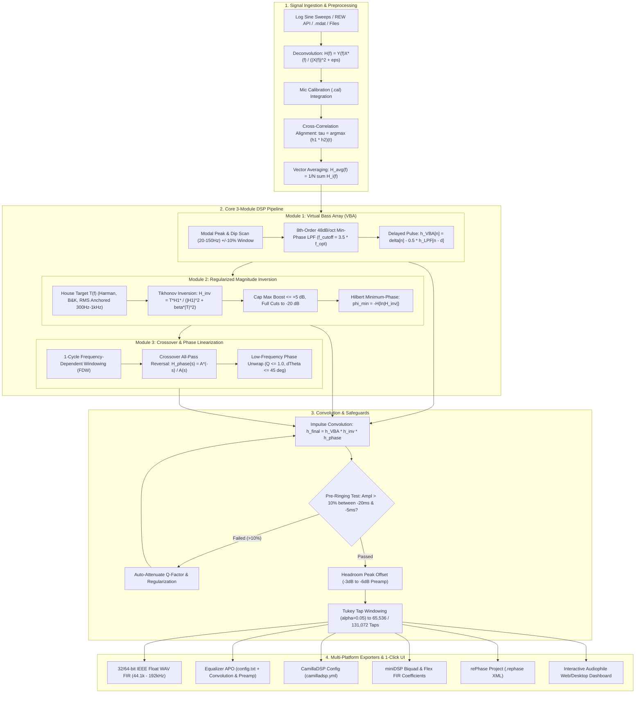

# AutoRoomEQ: 1-Click High-Fidelity Room Correction & REW/rePhase Studio

AutoRoomEQ is an automated, audiophile-grade digital room correction suite inspired by OCA (Obsessive Compulsive Audiophile / Audyssey One / A1 Evo). It seamlessly bridges Room EQ Wizard (REW) via its local REST API (`http://localhost:4735`) and runs an end-to-end Python DSP engine to deliver automated, phase-linearized digital room correction in a **1-Click workflow**.

---

## Key Features & DSP Pipeline



---

## Technical Safeguards & Innovations

### 1. Harmonic Peak Matching ($\pm 10\%$ Room Tolerance Window)
In real rooms, wall boundary materials (drywall compliance, glass, concrete) and furniture shift room mode frequencies from idealized rectangular room formulas ($f_k = k \cdot \frac{c}{2L}$). AutoRoomEQ searches with a $\pm 10\%$ harmonic tolerance band for fundamental $P_1, P_2, P_3$ modes and boundary cancellation dips $D_1, D_2$, applying full modal cuts while capping anti-null boosts to $+5\text{ dB}$ to prevent driver damage and clipping.

### 2. Pre-Ringing Safeguard & Time-Domain Step Response Evaluation
Sharp linear-phase filters can produce audible pre-ringing before transients ($t < 0\text{ ms}$). AutoRoomEQ evaluates the synthesized time-domain step response $s(t)$ and impulse response $h(t)$ in the pre-transient window $[-20\text{ ms}, -5\text{ ms}]$. If pre-ringing exceeds **$10\%$ normalized amplitude**, the algorithm automatically attenuates filter Q-factors and increases regularization damping.

### 3. Automated Tap Trimming & Headroom Protection
Filters are smoothly tapered (using Tukey $\alpha = 0.05$ or Blackman-Harris windows) to exact hardware tap counts ($4,096$, $65,536$, or $131,072$ taps) with zero truncation clicks. Peak gains are analyzed to compute the required global preamp headroom offset ($-3\text{ dB}$ to $-6\text{ dB}$) preventing inter-sample DAC clipping.

### 4. Subwoofer + Mains Time & Phase Alignment
Calculates the optimal delay ($\Delta t$ in milliseconds and samples) and acoustic polarity across the crossover overlap band ($40\text{ Hz} - 160\text{ Hz}$) to eliminate acoustic phase cancellation dips.

---

## Multi-Platform Hardware & Convolver Export Profiles

| Platform | Generated Files | Use Case |
| :--- | :--- | :--- |
| **Equalizer APO** | `EqualizerAPO/config.txt`, `AutoRoomEQ_Stereo_FIR_32bit.wav` | System-wide Windows PC audio / gaming / streaming |
| **CamillaDSP** | `CamillaDSP/camilladsp.yml`, `AutoRoomEQ_Left_FIR_32bit.wav`, `AutoRoomEQ_Right_FIR_32bit.wav` | Raspberry Pi streamer, Linux DACs, macOS |
| **miniDSP Flex / SHD** | `miniDSP/fir_coeffs_left.txt`, `miniDSP/fir_coeffs_right.txt` | Hardware DSP FIR convolution slots (4,096 taps) |
| **Roon / JRiver / HQPlayer**| `WAV_Filters/AutoRoomEQ_Stereo_FIR_32bit.wav` | Audiophile bit-perfect convolution playback |
| **rePhase** | `rePhase/AutoRoomEQ_Project.rephase` | Opening directly in rePhase for manual curve inspection |

---

## Quick Start Guide

### 1. Installation
```bash
git clone https://github.com/your-username/AutomaticDigitalRoomeq.git
cd AutomaticDigitalRoomeq
pip install -r requirements.txt
```

### 2. Launch the Application
```bash
python -m auto_roomeq.main
```
This starts the backend at `http://127.0.0.1:8000` and automatically opens the interactive Web Dashboard in your browser.

### 3. 1-Click Workflow
1. **Choose Input**: Select **Demo Audiophile Room** (for instant testing) or **Pull from REW API** (with REW open at `localhost:4735`) or upload your own files.
2. **Select Target House Curve**: Choose **Harman Reference (+6dB bass)**, **B&K 1974**, **OCA Audiophile**, or **Custom**.
3. **Click 🚀 "RUN 1-CLICK OPTIMIZATION"**:
   - Watch the live 8-stage progress checklist complete.
   - Inspect the Before vs Target vs After interactive SPL magnitude, phase, step response pre-ringing, and subwoofer summation curves.
4. **Click "📦 DOWNLOAD 1-CLICK PACKAGE (.ZIP)"**:
   - Unpack your ready-to-use Equalizer APO, CamillaDSP, miniDSP, and WAV FIR filters!

---

## Testing & Verification
Run the automated test suite with pytest:
```bash
pytest tests/ -v
```
All 10 tests verify DSP acquisition, deconvolution, vector averaging, Module 1 VBA, Module 2 Tikhonov inversion, Module 3 phase linearization, pre-ringing safeguards, and end-to-end orchestrator execution.
