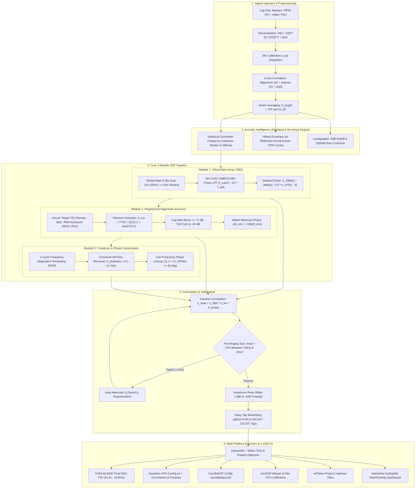

# ALTAIR: Automated Linear-phase Tuning & Acoustic Inversion Routine

**ALTAIR** is an automated, audiophile-grade digital room correction (DRC) and acoustic optimization suite. It bridges Room EQ Wizard (REW) via its local REST API (`http://localhost:4735`) and runs an end-to-end Python DSP engine to deliver automated, phase-linearized digital room correction in a **1-Click workflow**.

---

## Architecture & DSP Pipeline



---

## Technical Safeguards & Intelligence

### 1. Statistical Schroeder Frequency Detection
Rather than assuming a static transition frequency (~200–300 Hz), ALTAIR analyzes the moving variance of the modal spectrum. At low frequencies (modal zone), room resonance variance is high. Above the Schroeder transition frequency, modal density causes variance to settle into a stochastic baseline. This precisely identifies where to switch between modal cancellation and diffuse EQ.

### 2. Hilbert Analytic Reflection Gap & Auto FDW Tuning
Computes the Hilbert analytic signal envelope to detect the time gap $\Delta t$ between direct sound arrival and the first strong boundary reflection. Automatically calculates optimal Frequency-Dependent Window (FDW) cycles ($\text{Cycles} = \Delta t \cdot f_{\text{ref}}$) to isolate direct sound without cutting off bass transients or letting room reflections corrupt phase correction.

### 3. Harmonic Peak Matching ($\pm 10\%$ Room Tolerance Window)
In real rooms, wall boundary materials and furniture shift room mode frequencies from idealized rectangular room formulas ($f_k = k \cdot \frac{c}{2L}$). ALTAIR searches with a $\pm 10\%$ harmonic tolerance band for fundamental $P_1, P_2, P_3$ modes and boundary cancellation dips $D_1, D_2$, applying full modal cuts while capping anti-null boosts to $+5\text{ dB}$ to prevent driver damage and clipping.

### 4. Pre-Ringing Safeguard & Time-Domain Step Response Evaluation
Sharp linear-phase filters can produce audible pre-ringing before transients ($t < 0\text{ ms}$). ALTAIR evaluates the synthesized time-domain step response $s(t)$ and impulse response $h(t)$ in the pre-transient window $[-20\text{ ms}, -5\text{ ms}]$. If pre-ringing exceeds **$10\%$ normalized amplitude**, the algorithm automatically attenuates filter Q-factors and increases regularization damping.

### 5. Subwoofer + Mains Time & Phase Alignment
Calculates the optimal delay ($\Delta t$ in milliseconds and samples) and acoustic polarity across the crossover overlap band ($40\text{ Hz} - 160\text{ Hz}$) to eliminate acoustic phase cancellation dips.

---

## Multi-Platform Hardware & Convolver Export Profiles

| Platform | Generated Files | Use Case |
| :--- | :--- | :--- |
| **Equalizer APO** | `EqualizerAPO/config.txt`, `ALTAIR_Stereo_FIR_32bit.wav` | System-wide Windows PC audio / gaming / streaming |
| **CamillaDSP** | `CamillaDSP/camilladsp.yml`, `ALTAIR_Left_FIR_32bit.wav`, `ALTAIR_Right_FIR_32bit.wav` | Raspberry Pi streamer, Linux DACs, macOS |
| **miniDSP Flex / SHD** | `miniDSP/fir_coeffs_left.txt`, `miniDSP/fir_coeffs_right.txt` | Hardware DSP FIR convolution slots (4,096 taps) |
| **Roon / JRiver / HQPlayer**| `WAV_Filters/ALTAIR_Stereo_FIR_32bit.wav` | Audiophile bit-perfect convolution playback |
| **rePhase** | `rePhase/ALTAIR_Project.rephase` | Opening directly in rePhase for manual curve inspection |

---

## Quick Start Guide

### 1. Installation
```bash
git clone https://github.com/Hungbocluaqua/ALTAIR.git
cd ALTAIR
pip install -r requirements.txt
pip install -e .
```

### 2. Launch the Application
```bash
python -m auto_roomeq.main
```
This starts the backend at `http://127.0.0.1:8000` and automatically opens the interactive Web Dashboard in your browser.

### 3. 1-Click Workflow
1. **Choose Input**: Select **Demo Audiophile Room** or **Pull from REW API** (with REW open at `localhost:4735`) or upload your measurement files.
2. **Select Target House Curve**: Choose **Harman Reference (+6dB bass)**, **B&K 1974**, **OCA Audiophile**, or **Custom**.
3. **Click 🚀 "RUN 1-CLICK OPTIMIZATION"**:
   - Watch the live 8-stage progress checklist complete.
   - Inspect the Before vs Target vs After interactive SPL magnitude, phase, step response pre-ringing, and subwoofer summation curves.
4. **Click "📦 DOWNLOAD 1-CLICK PACKAGE (.ZIP)"**:
   - Unpack your ready-to-use Equalizer APO, CamillaDSP, miniDSP, and WAV FIR filters!

---

## Testing & Verification
Run the automated test suite with pytest:
```bash
pytest tests/ -v
```
All **89 tests** verify DSP acquisition, deconvolution, vector averaging, Module 1 VBA, Module 2 Tikhonov inversion (incl. SBIR/wavelet-decay hard-clamping and spatial variance weighting), Module 3 phase linearization (incl. regularized excess-phase inversion), acoustic intelligence (Schroeder, reflection gap, ISO 9613-1), Farina sweep ingestion, mic .cal application, pre-ringing safeguards with the Zwicker audibility gate, multi-sub MSO, WFIR exports, `.mdat` parsing, SSE streaming, session persistence, and end-to-end orchestrator execution.

## Recent Enhancements (Roadmap Activation)
- **Live pipeline wiring**: Farina harmonic separation (recorded-sweep uploads), mic `.cal` ingestion, multi-seat spatial variance weighting, wavelet modal-decay gating, SBIR hard clamps, closed-loop pre-ringing attenuation with Zwicker masking gate, and Multi-Sub Matrix Optimization (2–4 subwoofers).
- **Physics & psychoacoustics**: ISO 9613-1 air-absorption target adaptation and continuous ERB smoothing for multi-seat averaging.
- **DSP/export**: regularized excess-phase deconvolution in Module 3, hybrid IIR+FIR miniDSP setup file, and optional Warped FIR (WFIR) exports for embedded DSPs.
- **System & UX**: live SSE progress streaming (`POST /api/optimize/stream`) into the UI, best-effort `.mdat` parsing, and JSON project session persistence (`altair_project.json`).
See `ARCHITECTURE_ANALYSIS.md` for the complete architecture reference.
